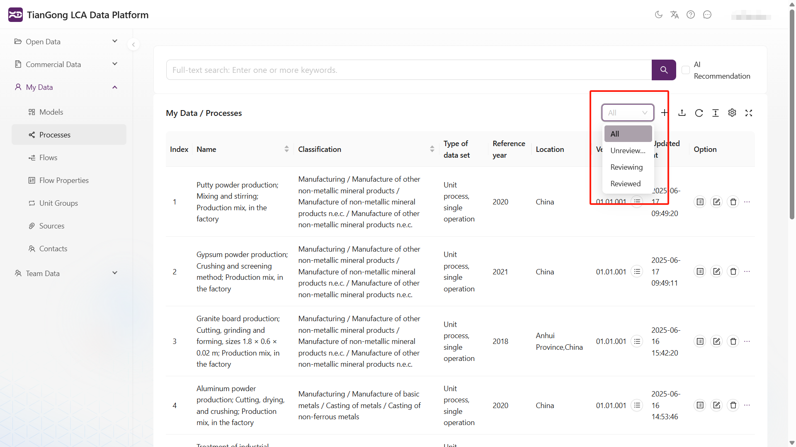
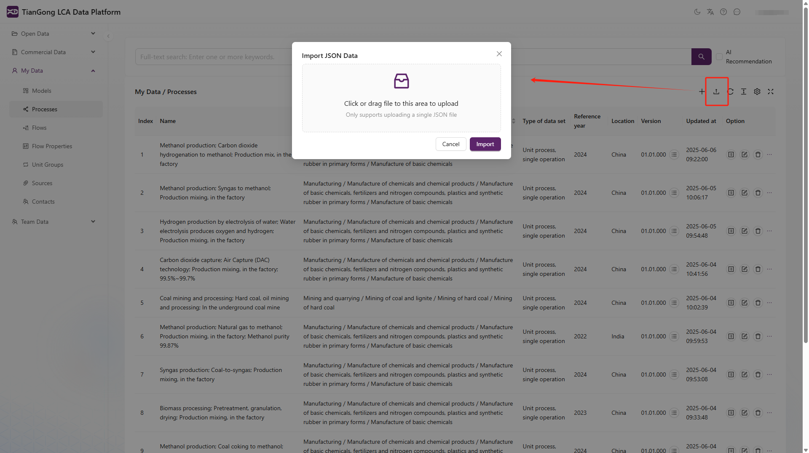

# 功能更新

## 2025-06-17

### 新增功能：审核情况可筛选：全部/未审核/正在审核/已审核

平台新增「审核状态」筛选功能，支持用户在审核列表中按不同状态筛选查看数据或项目的审核进展情况，提升数据管理效率与可视性。

用户可通过下拉菜单选择以下状态：

✅ 全部：展示所有审核记录（不受状态限制）

🕒 未审核：显示尚未进入审核流程的条目

🔄 正在审核：显示已提交审核但尚未完成的记录

✔️ 已审核：显示审核通过或已完成的记录

## 2025-06-06

### 新增功能：数据导入与导出功能，数据校验功能。

1.数据导入功能（Import）

用户可以通过页面右上角的“上传”图标（📤）进入导入界面，上传本地的 JSON 文件，将数据导入到平台数据库中。支持的导入格式为标准化的 .json 文件，系统将自动解析文件内容并匹配字段。

⚠️ 当前版本仅支持导入结构标准、无嵌套错误的 JSON 数据。

2.数据导出功能（Export）

平台支持用户按需导出数据记录，便于本地备份、审阅或第三方使用。

⚠️ 导出格式为标准 .json 文件，字段结构与平台兼容。

3.新增「数据校验（Data check）」按钮：审核前主动检测必填项

在编辑数据集（Edit process）界面底部，新增 “Data check” 按钮，用户可在点击“提交审核（Submit for review）”前，先运行一次完整性自检。该功能对用户提前发现问题、减少审核返工有重要帮助。

4.提交审核后如有数据不完整等问题会弹出提示

在用户点击提交审核（Submit for review）按钮时，系统将自动执行引用数据的初步校验流程，若发现问题，则弹出详细提示框，列出所有未通过项。如图所示，便于用户快速定位并修改。

