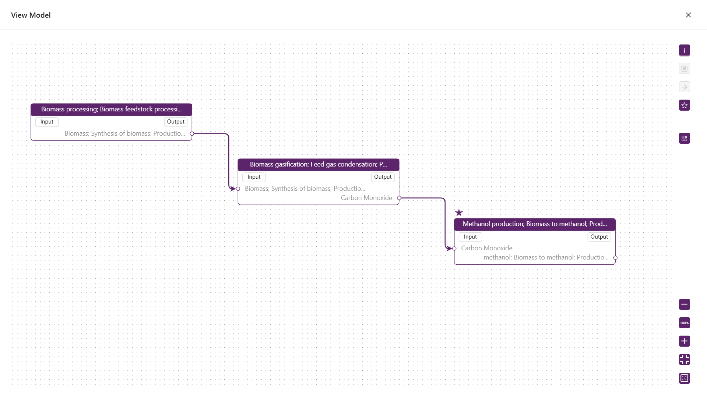
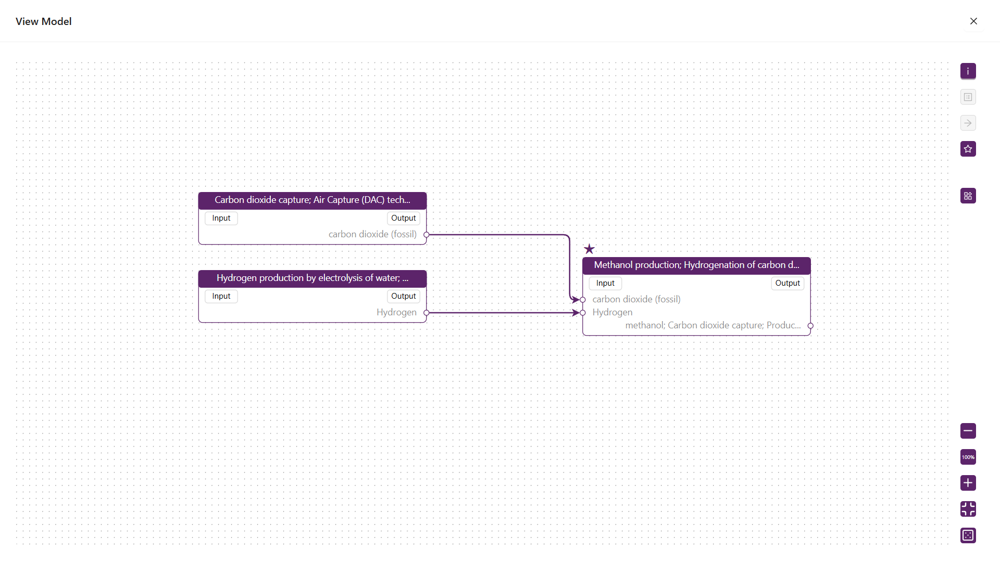

# 部分终止系统建模

此部分基础信息应概述由三个单元过程构成的整体系统结构，并简要说明它们在生命周期模型中的集成方式。对应的生命周期模型图也应展示这三个单元过程的连接关系，反映出系统边界内的完整物质与能量流动路径。

平台建模操作参考

- [新建数据-新建模型](/user-guide/create-my-data#create-model)

## 建模展示

基础信息概述参考：

## 其他模型注意事项

### 注意单元过程的连接关系

【二氧化碳捕集制甲醇】建模时，单元过程连接关系如下：

