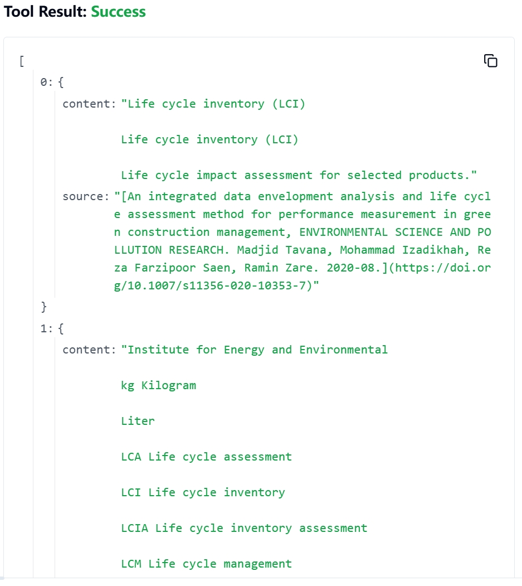
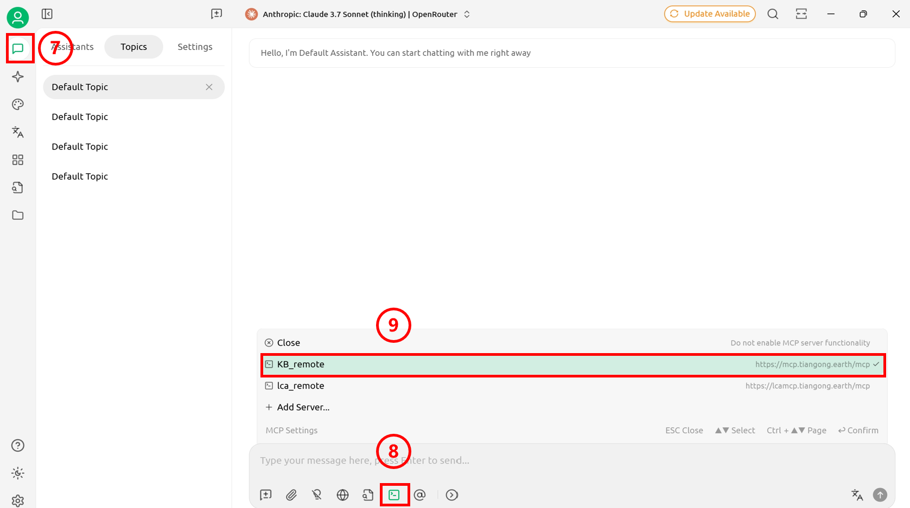
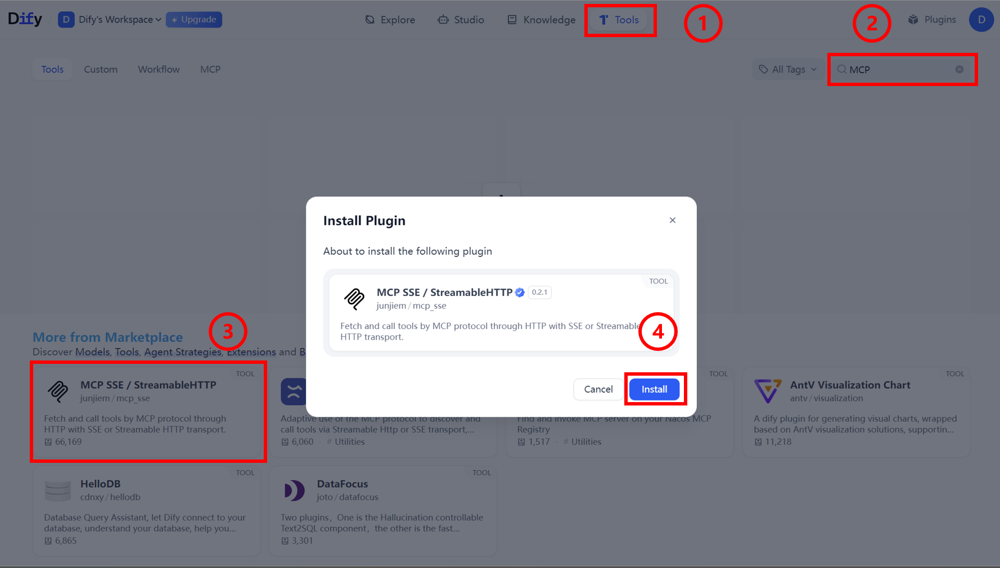

# 天工知识库MCP

## 远程认证

### API Key

欲获取API Key，请与清华大学环境数据科学与系统工程团队联系。

## MCP Server的调用

### Inspector

**MCP Inspector启动：在终端输入如下命令，输入后自动跳转至Inspector页面**  

```bash
npx @modelcontextprotocol/inspector
```

1. Transport Type配置：在Inspector页面，点击下拉框，选择Streamable HTTP。  
2. url配置：填写MCP Server端口<https://mcp.tiangong.earth/mcp。>  
3. 令牌配置：将上述流程获取的API Key填入相应的token字段。
4. Server连接：点击connect进行连接  
**页面连接成功，下面以检索为例展示应用方法**  
5. 操作选择：在页面上边栏点击Tools按键。  
6. 列表展开：点击List Tools按键，出现下拉列表。  
7. 工具选择：点击列表中的Search_Sci_Tool按键。  
8. 搜索配置：在对应框中输入检索信息，并对检出内容进行相应设置。  
9. 工具运行：点击Run Tool运行工具，显示输出。  

    
    **搜索结果如图**  

    

### Cherry studio

1. 打开设置面板：点击侧边栏设置键，打开面板。  
2. 打开MCP设置：选择 MCP Settings，跳转至MCP配置界面。  
3. 添加MCP Server：点击右上角 Add Server按键，跳转至MCP Server配置界面。

    

4. 信息填写：配置本地MCP Server的基本信息（Headers处的XXX为获得到的API Key）。

    >Type:Streamable HTTP  
    >URL:><https://mcp.tiangong.earth/mcp>  
    >headers:  
    >Content-Type=application/json  
    >Authorization=Bearer XXX

5. 保存信息：点击"Save"键保存设置。
6. 启动MCP连接：点击打开MCP Server。

    

7. 打开聊天界面：点击侧边栏最上方按钮，返回主页面。配置模型（参照[官方文档]），创建聊天页面。  
8. Server连接：点击对话下方的MCP Settings按键。  
9. MCP选择：选择需要的MCP。

    
  
    <video src="img/3.mp4" controls width="600">
      您的浏览器不支持视频播放。
    </video>

### Dify

1. 工具页面访问：点击上边栏"Tools"选项，跳转至工具管理页面。  
2. MCP工具搜索：在搜索栏输入"MCP"关键词进行搜索。  
3. 工具市场下载：在Market place中找到并下载MCP工具（图中框选工具为推荐工具）。  
4. 工具安装执行：点击"安装"按钮，完成MCP工具安装。  


5. 配置栏打开：MCP工具安装完成后，点击弹出配置栏。  
6. 授权配置访问：点击"Authorization"处进行MCP授权配置。  
7. 配置窗口打开：点击后弹出MCP详细配置窗口。  
8. 基本信息填写：在配置窗口中填写必要的连接信息。  
9. 配置信息保存：完成填写后点"保存"按钮。  
10. 工作流构建：在Dify中构建工作流或智能体调用MCP。  
>
>1. 智能体、工作流的创建可参照[官方文档](https://docs.dify.ai/zh-hans/guides/application-orchestrate/creating-an-application)。
>2. MCP应用请参照[官方文档](https://docs.dify.ai/zh-hans/guides/tools/mcp)

  
