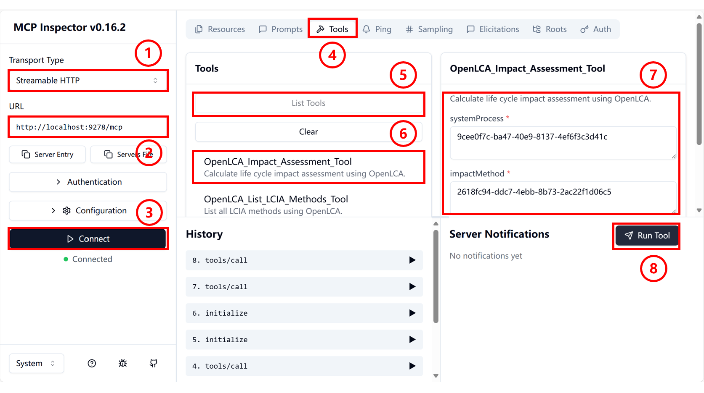
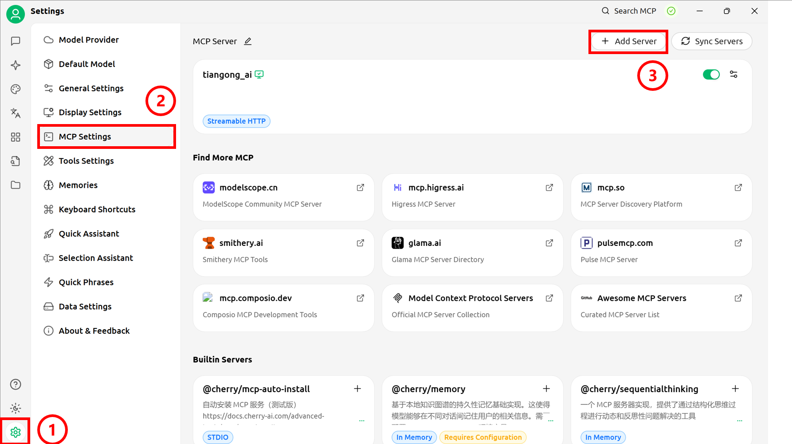

# 天工LCA MCP（本地）
## openLCA配置
### openLCA安装
在[openLCA官网](https://www.openlca.org/download)，参照页面提示下载openLCA软件至本地。  
### 文件导入
**点击软件图标，进入下载好的openLCA界面，开始文件导入**  
1. 菜单展开：点击左上角“File”菜单，展开下拉列表。  
2. 选择导入：在菜单中，点击“Import”选项，准备导入数据文件。  
3. 导入文件：在“Import”子菜单中，依据实际的数据格式，选择“File”或“Other”。

| 导入选项 | 目的                             | 常见支持格式/类型                                      |
| :------- | :------------------------------- | :----------------------------------------------------- |
| **File** | 导入完整数据库或标准数据集文件。 | `.zolca`, `EcoSpold`, `ILCD`, `SimaPro CSV`, `Excel`   |
| **Other** | 导入特定组件或进行高级导入配置。 | 导入整个数据库，特定组件 (过程、流、方法等)，`GeoJSON`, 映射文件 |
4. 浏览数据：导入完成后，在主界面导航栏中展开数据并查看。  

  

### IPC Server
1. 菜单展开：点击左上角“Tools”菜单，展开下拉列表。  
2. 工具选择：在菜单中，点击“Developer tools”选项。  
3. 打开配置面板：在“Developer tools”子菜单中，选择“IPC Server”。    
4. 端口配置：跳转至界面“Start an IPC Server”，在Port栏填写IPC Server的启动端口（建议为8080）。  
5. 服务启动：点击绿色按钮，启动IPC Server。  

  
## MCP Server
### nvm安装
依据系统类型，在在对应的官方网站([Windows](https://github.com/coreybutler/nvm-windows/releases)、[Linux、macOS](https://github.com/nvm-sh/nvm))按照文档下载nvm至本地。  
### Node.js包
**依据电脑的系统（windows/linux/mac）打开对应的终端，依照下文的提示输入相应指令**  
1. Node.js下载/启用  
```bash
# 安装Node.js版本22
nvm install 22
# 配置使用的Node.js版本
nvm use <version>
```
2. MCP-Server package安装  
```bash
# 安装package
npm install -g @tiangong-lca/mcp-server@0.0.14
```
3. MCP-Server启动  
```bash
# 启动MCP-Server
npx -p @tiangong-lca/mcp-server tiangong-lca-mcp-http-local
```
## MCP Server的调用
### Inspector
**MCP Inspector启动：在终端输入如下命令，输入后自动跳转至Inspector页面**  
```bash
npx @modelcontextprotocol/inspector
```
1. Transport Type配置：在Inspector页面，点击下拉框，选择Streamable HTTP。  
2. url配置：填写MCP Server端口http://localhost:9278/mcp。  
3. Server连接：点击connect进行连接    

**页面连接成功，下面以环境影响评估为例展示应用方法**  
4. 操作选择：在页面上边栏点击Tools按键。  
5. 列表展开：点击List Tools按键，出现下拉列表。  
6. 工具选择：点击OpenLCA_Impact_Assessment_Tool按键。  
7. UUID配置：在openLCA里找到systemProcess与impactMethod对应的UUID，输入对应框中。  
8. 工具运行：点击Run Tool运行工具，显示输出。  


**计算结果如图**  


### Cherry Studio
**在[Cherry Studio官网](https://www.cherry-ai.com/download)，参照[官方文档](https://docs.cherry-ai.com/pre-basic/installation)下载软件至本地并打开。**
1. 打开设置面板：点击侧边栏设置键，打开面板。  
2. 打开MCP设置：选择 MCP Settings，跳转至MCP配置界面。  
3. 添加MCP Server：点击右上角 Add Server按键，跳转至MCP Server配置界面。  

  
4. 信息填写：配置本地MCP Server的基本信息。  
>Type:Streamable HTTP  
>URL:http://localhost:9278/mcp
5. 保存信息：点击"Save"键保存设置。
6. 启动MCP连接：点击打开MCP Server。

  
7. 打开聊天界面：点击侧边栏最上方按钮，返回主页面。配置模型（参照[官方文档](https://docs.cherry-ai.com/pre-basic/providers)），创建聊天页面。  
8. Server连接：点击对话下方的MCP Settings按键。  
9. MCP选择：选择需要的MCP。  

  
<video src="img/1.mp4" controls width="600">
  您的浏览器不支持视频播放。
</video>

### Dify
**依照dify[官方文档](https://docs.dify.ai/zh-hans/getting-started/install-self-hosted/readme)，在本地进行部署，部署完成后启动项目，进行如下操作**  

1. 工具页面访问：点击上边栏"Tools"选项，跳转至工具管理页面。
2. MCP工具搜索：在搜索栏输入"MCP"关键词进行搜索。
3. 工具市场下载：在Market place中找到并下载MCP工具（图中框选工具为推荐工具）。
4. 工具安装执行：点击"安装"按钮，完成MCP工具安装。

   
5. 配置栏打开：MCP工具安装完成后，点击弹出的配置栏。  
6. 授权配置访问：点击"Authorization"处进行MCP授权配置。  
7. 配置窗口打开：点击后弹出MCP详细配置窗口。  
8. 基本信息填写：在配置窗口中填写必要的连接信息。(下附示例)
```JSON
{
  "tiangong_lca_remote": {
    "transport": "streamable_http",
    "url": "http://host.docker.internal:9278/mcp  ",
    "headers": {
      "Accept": "application/json,text/event-stream",
    },
    "timeout": 50,
    "sse_read_timeout": 50
  }
}
``` 
9. 配置信息保存：完成填写后点击"保存"按钮。    

  
10. 工作流构建：在Dify中构建工作流或智能体调用MCP。
>1. 智能体、工作流的创建可参照[官方文档](https://docs.dify.ai/zh-hans/guides/application-orchestrate/creating-an-application)。
>2. MCP应用请参照[官方文档](https://docs.dify.ai/zh-hans/guides/tools/mcp)