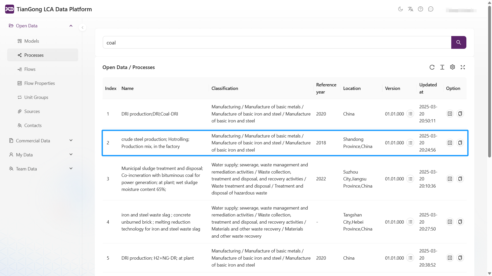
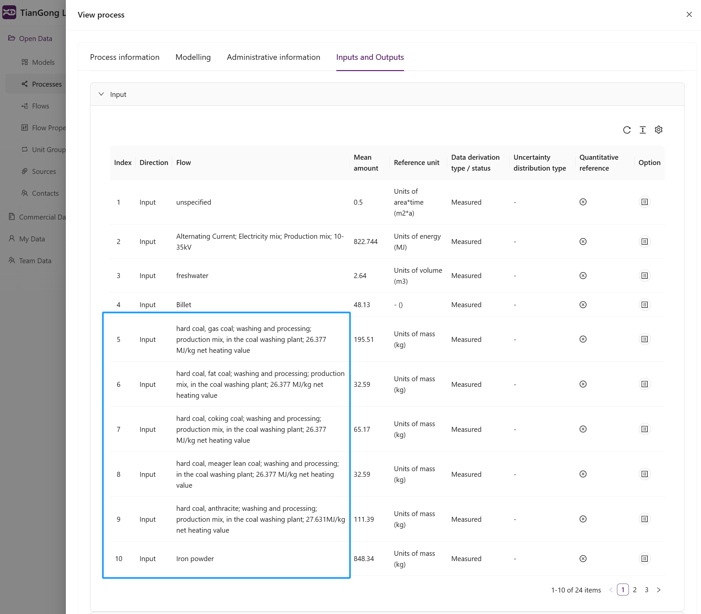

# 数据搜索功能

天工LCA平台提供强大的全文搜索功能，支持在所有数据模块中进行跨字段搜索。这一特性使天工LCA平台在数据检索能力上显著优于其他LCA平台。

## 搜索功能特点

- **全文搜索**：支持在所有字段中进行深度搜索，包括但不限于名称、分类、流属性等关键字段
- **智能匹配**：支持模糊搜索、精确匹配和AI智能推荐
- **实时结果**：搜索结果即时呈现，支持多维度筛选和灵活排序

## 搜索示例

### 场景一：过程数据搜索

1. 进入"开放数据"模块
2. 选择"过程"分类
3. 在搜索框中输入"煤炭"
4. 系统将返回所有字段中包含"煤炭"相关内容的匹配结果，包括但不限于名称、分类、输入输出所选择的流的名称等字段

输入"coal"进行搜索：

其中"crude steel production; Hotrolling; Production mix, in the factory"过程数据集，是因为其input选择了"coal"流，所以也被搜索到了。

## 搜索功能优势

| 功能 | 天工LCA平台 | 其他LCA平台 |
|------|-------------|-------------|
| 全文搜索 | ✔️ 支持所有字段 | ❌ 仅支持名称搜索 |
| 跨模块搜索 | ✔️ 统一搜索界面 | ❌ 需切换模块 |
| 智能匹配 | ✔️ 支持智能搜索 | ❌ 仅支持精确匹配 |
| 实时结果 | ✔️ 即时显示 | ❌ 需要刷新页面 |

## 注意事项

- 搜索结果受用户权限限制
- 商业数据模块仅显示元数据搜索结果
- 建议使用标准分类体系以提高搜索效率
