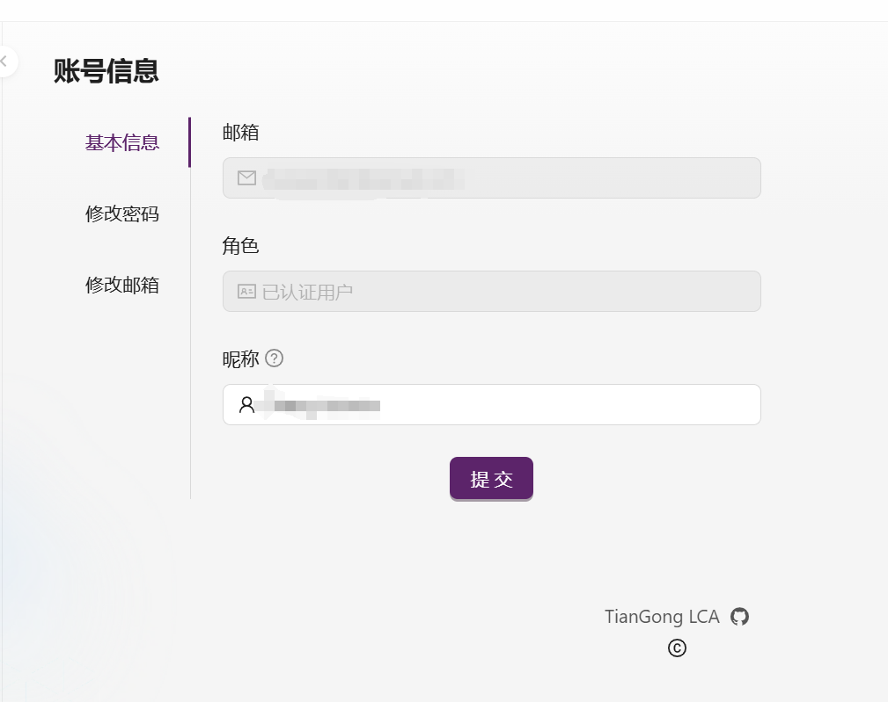
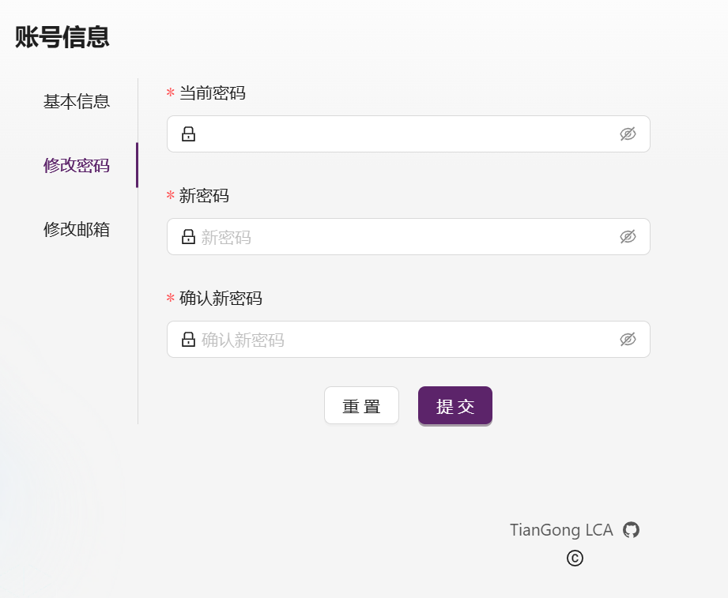
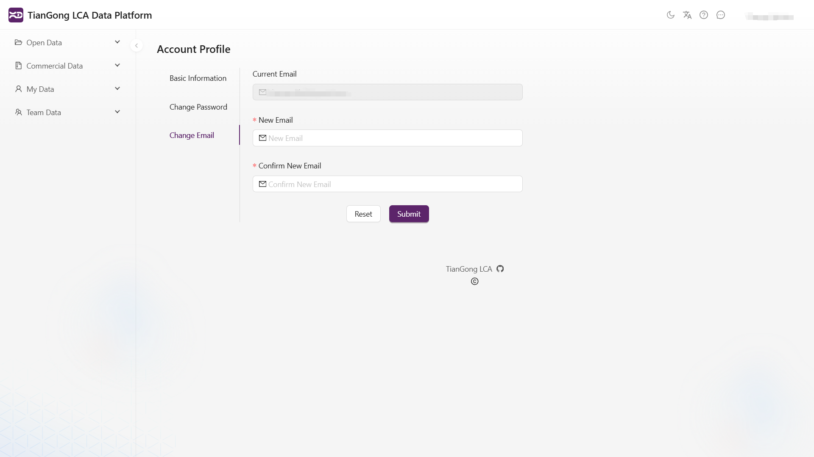

# 账号管理

点击右上角用户名，选择**账号信息**，您可以查看和修改您的账号信息。

**账号信息**分为**基本信息**、**修改密码**和**修改邮箱**三个部分：

## 基本信息

在这一部分，您可以查看当前邮箱、角色和昵称等信息，并对昵称进行编辑。编辑完成后，右上角显示的信息（默认是注册时的邮箱地址）会立即更新为您设置的昵称。

## 修改密码

系统默认保存您的初始密码。您只需输入新密码和确认新密码即可完成密码更改。

## 修改邮箱

系统会显示您当前的注册邮箱。您只需输入新邮箱地址并确认即可完成修改。

