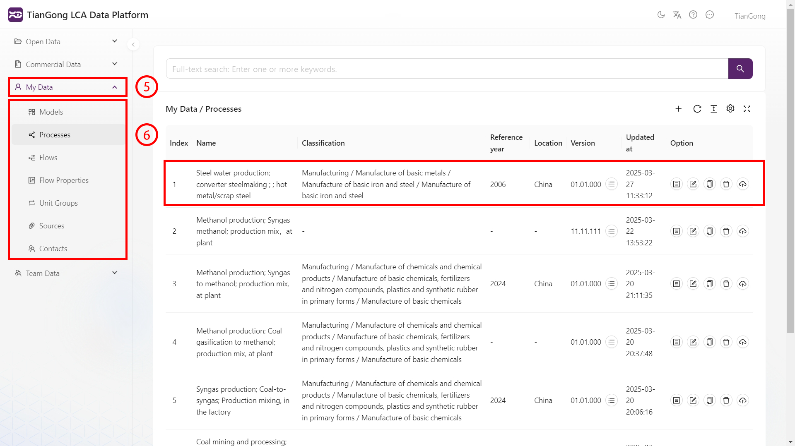

# 数据使用

## 数据查看

1. 展开数据面板：定位左侧导航栏，单击“开放数据”或“商业数据”，激活数据管理界面。
2. 定位过程目录：在分级列表中选中目标条目，页面跳转至相应数据空间。
3. 查看数据：点击相应数据列表右侧的“查看”键，可查看数据的全维度信息。包含[地理位置坐标、时间戳范围、系统边界、输入输出清单、所属行业与产品等](https://www.carbonfootprint.network/docs/cifa-guidelines/lca-database-guideline/chapter-6-appendix#%E4%BA%A7%E5%93%81%E6%B5%81%E5%88%86%E7%B1%BB)。
4. 查看历史版本：在数据集列表点击“所有版本”键，页面跳转至“所有版本”页面，在此可查看数据的所有历史版本。
5. 查看历史版本数据：点击相应历史版本列表右侧的“查看”键，可查看历史数据的详细信息。
 

## 数据引用

1. 展开选择面板：在需要引用的界面，点击该界面所选内容边的“选择”键，点击后将弹出信息面板。  
2. 切换信息分类：通过顶部导航栏可点选目标数据目录，界面将动态跳转至对应界面。  
3. 数据选取：在列表中勾选目标信息（选中行显示紫色衬底），左侧状态栏同步显示所选数据。
4. 保存信息修改：点击编辑页底部“保存”按钮，系统返回上级面板。

>注意点：**商用数据不支持引用操作**

  

## 数据复制  

1. 展开数据面板：定位左侧导航栏，单击“开放数据”或“商业数据”，激活数据管理界面。
2. 定位过程目录：在分级列表中选中目标条目，页面跳转至相应数据空间。
3. 展开复制页面：点击“复制数据”，弹出“复制信息”页面。
4. 保存信息修改：点击编辑页底部“保存”按钮，系统返回上级面板。
5. 展开数据面板：定位左侧导航栏，单击“我的数据”，激活数据管理界面。
6. 定位过程目录：在分级列表中选中目标条目，页面跳转至对应数据空间，在此可看到已经复制的数据副本，可对数据进行修改等操作，操作指引详见[我的数据](./create-my-data)。

