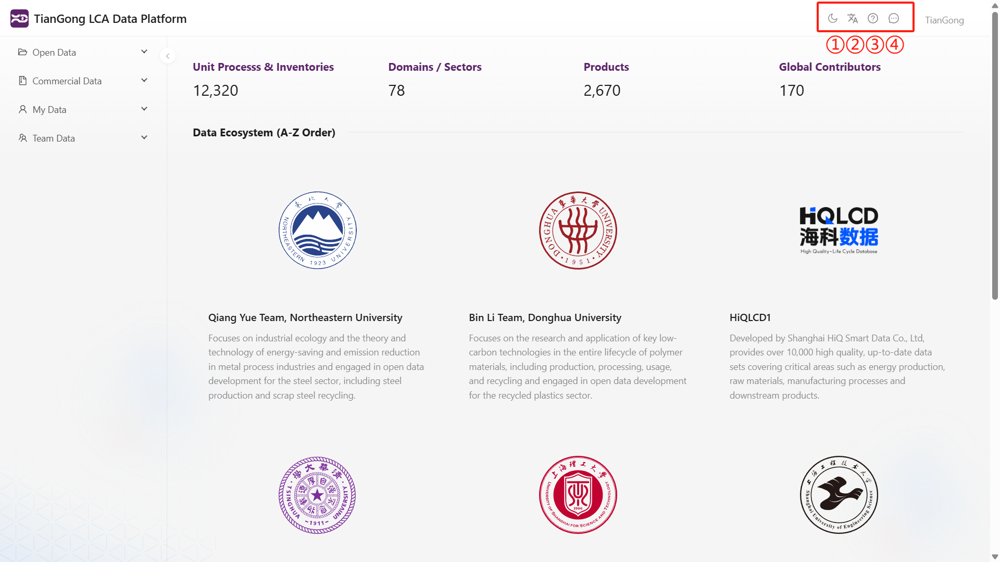

# 按键功能介绍

本节将帮助您了解平台界面中各个按键的具体功能及其使用方法，方便您高效操作和管理生命周期评价相关数据。

## 主界面右上角功能按键说明

主界面右上方依次设置了以下功能按键：

① 白天/夜间模式切换

点击该图标可在白天模式与夜间模式之间切换，便于根据使用环境调整界面显示效果，提升视觉体验。

② 中英文语言切换

通过该按钮，用户可在中文和英文界面间自由切换，满足不同语言背景用户的使用需求。

③ 平台说明文档入口

点击问号图标将跳转至天工平台的说明文档页面，用户可查阅平台的详细使用方法及常见问题解答。

