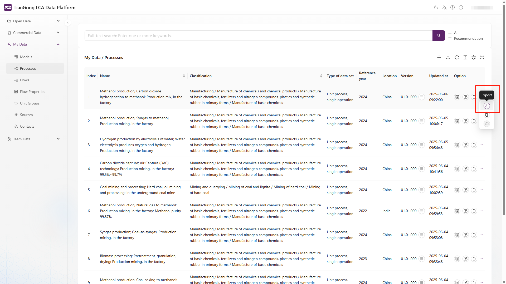

# 按键功能介绍

本节将帮助您了解平台界面中各个按键的具体功能及其使用方法，方便您高效操作和管理生命周期评价相关数据。

## 主界面右上角功能按键说明

主界面右上方依次设置了以下功能按键：

### ① 浅色/深色模式切换

切换浅色和深色模式，适应不同光线环境和用户习惯。

### ② 多语言切换

选择适合的语言，平台将显示为所选语言。

### ③ 平台说明文档入口

点击问号图标将跳转至天工平台的说明文档页面，用户可查阅平台的详细使用方法及常见问题解答。

### ④ 平台消息提醒

提供实时消息提醒，帮助用户及时了解平台通知。

## 公开数据界面按键说明

### ⑤ 页面刷新按钮

刷新页面，查看最新数据和信息。

### ⑥ 数据展示密度调节

支持切换宽松、中等、紧凑三种密度，以满足不同屏幕与操作偏好，默认设置为中等。

### ⑦ 列设置 选择显示的数据列

支持筛选的列内容有：序号、名称、分类、版本、更新时间、操作。点击重置可以将设置恢复到默认状态，快速回到原始显示设置。

### ⑧ 全屏按钮

点击该按钮后，页面进入全屏数据查看模式：左侧导航栏隐藏，顶部搜索框收起，最大化数据表格区域。

全屏模式且展示可筛选的列内容如下图：

### ⑨ 查看所有版本

点击此按钮查看该文档的所有历史版本，帮助用户了解文档的更新和变化。

### ⑩ 查看数据详情（只读）

可查看全部数据内容与结构，不可编辑。

### ⑪ 复制功能

可快速创建该数据项的一个副本，用于基于现有数据快速建模或修改。

### ⑫ 数据导出

将该数据项导出为标准 .json 文件，便于离线备份、本地分析或跨系统对接使用。

⚠️ 导出格式为标准 .json 文件，字段结构与平台兼容。

## 我的数据界面按键说明

不赘述页面中相同按钮功能，以下是**我的数据**界面特有的按键功能说明。

### ⑬ 新增数据项

点击此按钮新增一个数据项，创建新的数据记录。了解如何新建数据，请查看[数据新建](/docs/user-guide/create-my-data.md)。

### ⑭ 数据导入

支持的导入格式为标准化的 .json 文件，系统将自动解析文件内容并匹配字段，见下图。

### ⑮ 编辑信息

编辑当前数据项的详细信息，更新数据内容。

### ⑯ 贡献给团队

将当前数据项贡献给团队，允许其他成员查看和使用。

⚠️ 当前版本仅支持导入符合TIDAS结构标准、无嵌套错误的 JSON 文件。

## 团队数据管理界面按键说明

团队管理界面提供了便捷的管理功能，允许团队负责人进行团队成员的管理和操作。

### ⑰ 移除成员

将成员移出团队。

### ⑱ 设为管理员

赋予特定成员团队管理权限。

### ⑲ 设为成员

需要撤销某成员的管理员权限时，可以通过此按钮将其设为普通成员。

### ⑳ 重新邀请

对未成功加入的成员再次发出邀请。

### ㉑ 邀请成员

通过搜索用户名邀请新成员加入团队。

