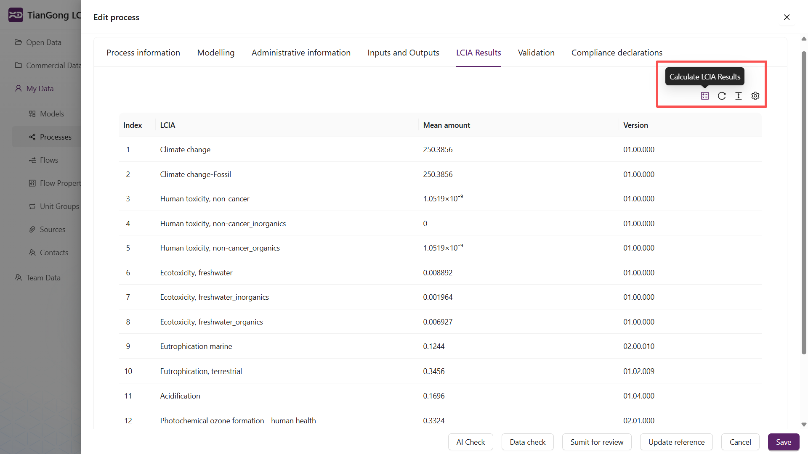

# LCIA计算与查看

本页简要说明如何在平台上触发 LCIA（生命周期影响评价）计算、查看结果以及常见问题排查要点。

## 简介

LCIA（生命周期影响评价）是将 LCI（清单清查）结果转化为环境影响指标的计算过程。平台支持在模型与过程层级触发 LCIA 计算并查看核算结果。

## 前置条件

- 使用平台提供的标准流属性与单位，避免自建单位组或流属性，详见 [数据新建](/user-guide/create-my-data) 中的注意项。自定义单位或属性可能导致 LCIA 无法计算或结果错误。
- 模型或过程应已正确绑定输入/输出流，并设定基准流（参考流）。

## 如何计算

在“我的数据 → 过程”中打开单元过程，点击编辑，点击页面上的“LCIA 结果”查看过程层级的核算结果。

## 结果查看说明

- 结果通常以各影响类别（如温室气体、臭氧消耗、酸化等）列出，支持按功能单元或基准流量进行归一化展示。
- 可在模型结果面板切换查看不同影响类别或导出结果用于后续分析。

- 注意：过程的 LCIA 仅计入该过程涉及的基本流（elementary flows）所造成的环境影响，不包含过程产生的其他产品或废物流的环境影响。

## 常见问题与排查

- 无法计算或部分影响类别缺失：检查所用流是否具有标准流属性和单位，确认是否为平台提供的标准属性。
- 结果异常（量级错误）：检查单位是否一致或是否使用了自建单位组导致换算错误。

若遇到无法解决的问题，请先检查 `我的数据` 中的流/单位/流属性设置，并参考： [数据新建](/user-guide/create-my-data) 与 [数据平台介绍](/user-guide/data)。
