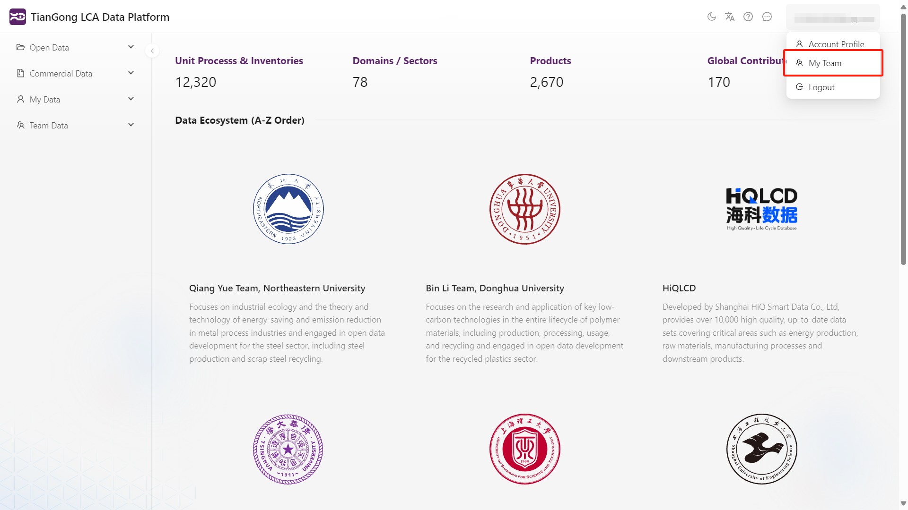
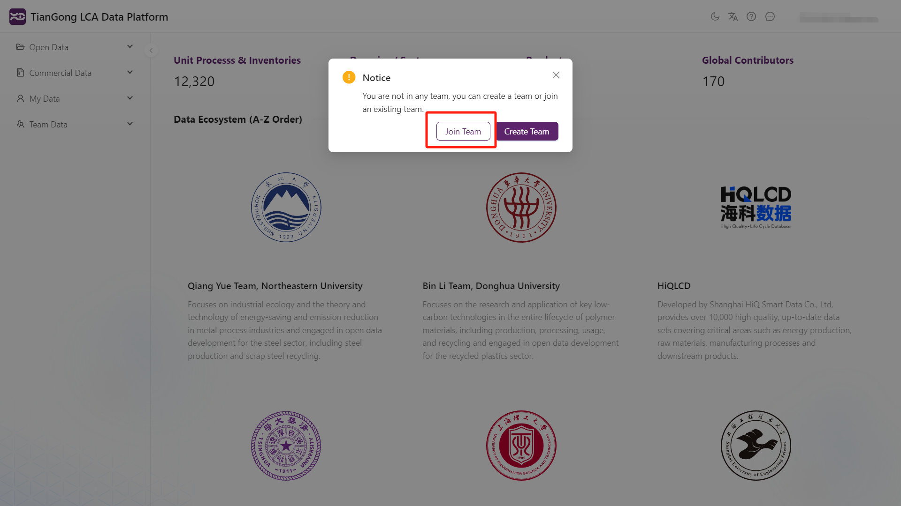
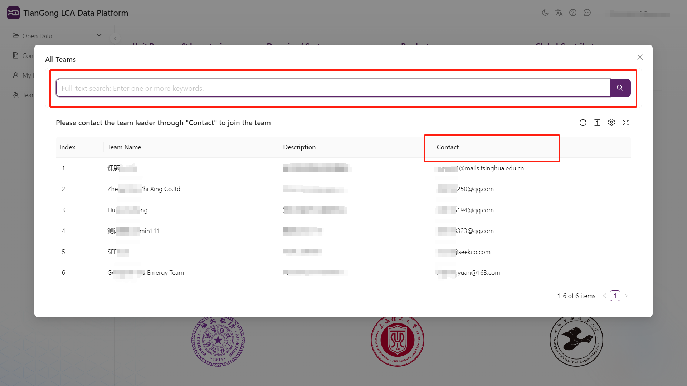
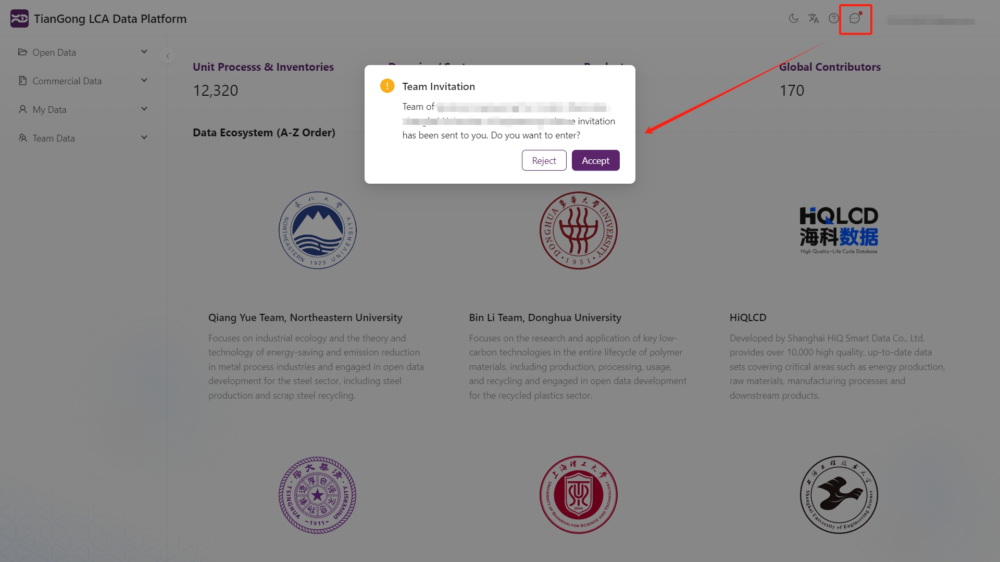
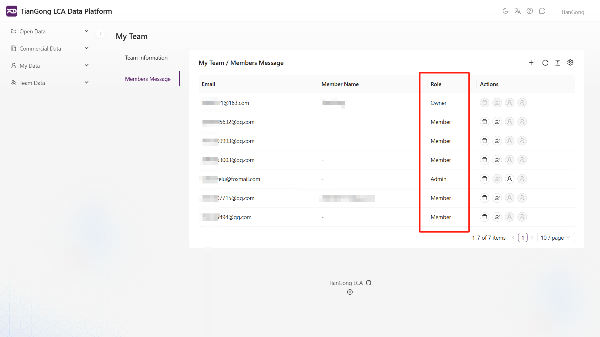

# 团队功能介绍

本节将帮助您了解平台中的团队功能，便于协同管理和共享生命周期评价相关数据。

## 功能概述

本平台支持用户创建或加入团队，实现团队成员间的数据共享与协同管理。用户可选择：

- **创建团队**：成为团队负责人（所有者），拥有管理权限，可设置管理员、增删成员。

- **加入团队**：需通过团队负责人或管理员邀请方可加入团队。

用户点击**我的团队**后，未加入团队的成员可选择创建团队或加入团队。

---

## 创建团队

点击“创建团队”按钮，填写团队名称、简介等基本信息，即可成功创建团队。

---

## 加入团队

普通用户可通过“加入团队”按钮，搜索想要加入的团队，并通过页面提供的**联系方式**与团队负责人取得联系。  

⚠️ 目前仅支持团队**所有者和管理员邀请加入**，用户无法主动加入团队。

---

## 团队邀请与加入流程

1. **所有者和管理员邀请成员**：  

在团队管理页，团队所有者和管理员可通过搜索用户名邀请新成员。

2. **成员接收邀请**：  

被邀请成员将在平台右上角消息图标看到红点提示，点击查看消息并同意邀请后，即可加入团队。

3. **加入成功**：  

成员加入后可浏览和访问团队数据，也可贡献数据，参与团队协作。

---

## 团队管理功能

团队成员界面展示当前团队内所有成员的信息，包括：

- **用户名与邮箱**

- **成员角色**：分为三种类型：

- `所有者`（团队创建者，拥有最高权限）

- `管理员`（由所有者指定，具备管理权限）

- `成员`（普通成员，具备查看权限）

所有者在“我的团队”界面，可对团队成员进行如下管理操作：

- **邀请成员**：通过搜索用户名邀请新成员加入团队；

- **设为管理员**：赋予特定成员团队管理权限；

- **设为成员**：撤销管理员权限；

- **重新邀请**：对未成功加入的成员再次发出邀请；

- **移除成员**：将成员移出团队。

管理员在“我的团队”界面，可对团队成员进行如下管理操作：

- **邀请成员**：通过搜索用户名邀请新成员加入团队；

- **移除成员**：将成员移出团队。

如需详细了解各个按钮功能，请参考：[团队按键说明](/docs/user-guide/key-functions-introduction.md#团队数据管理界面按键说明)

---

## 常见问题

- **为何团队成员贡献的过程中输入输出某些流不显示单位？**  

已公开在系统中的标准流数据会自动显示单位；但团队成员自行新建的流若未同步至团队数据，将无法正确显示单位信息。请确保团队成员在贡献或使用过程中**同步了相关的流数据**，而不仅仅是过程数据。这样才能正常显示流的单位和属性信息。
