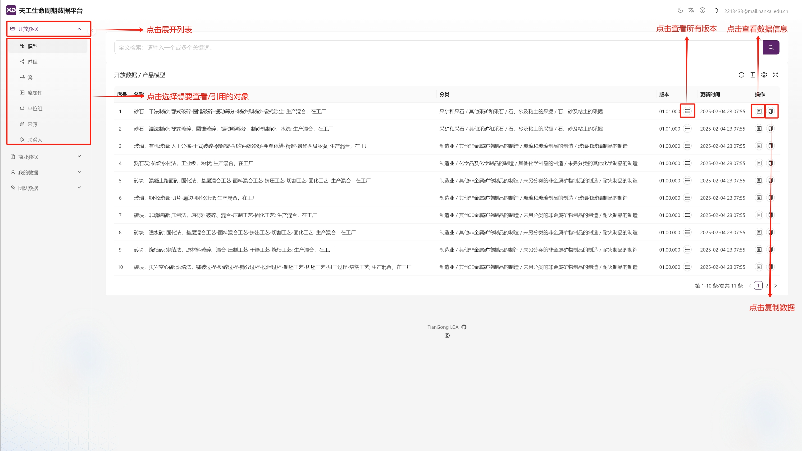
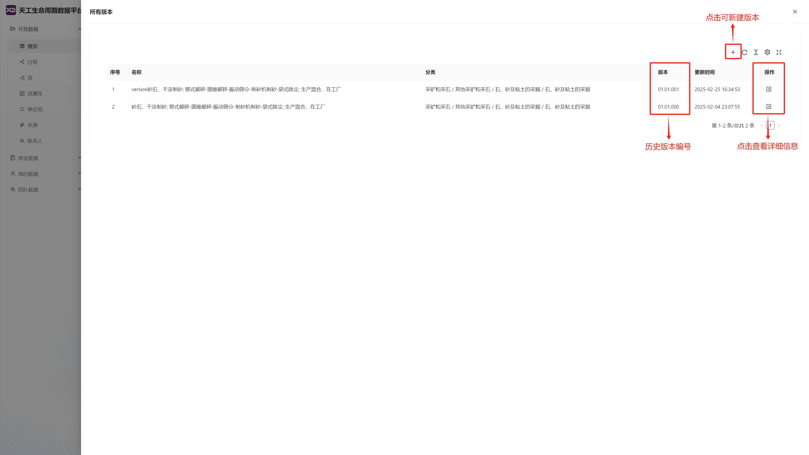
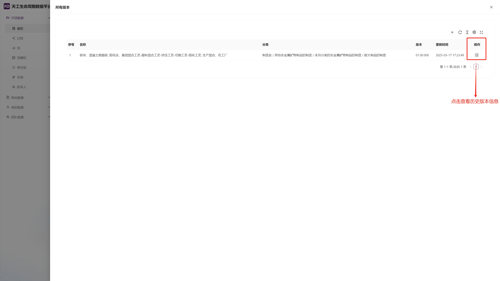
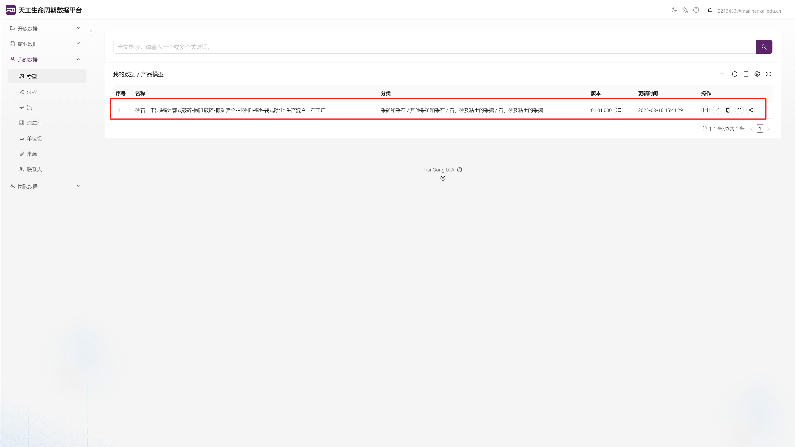
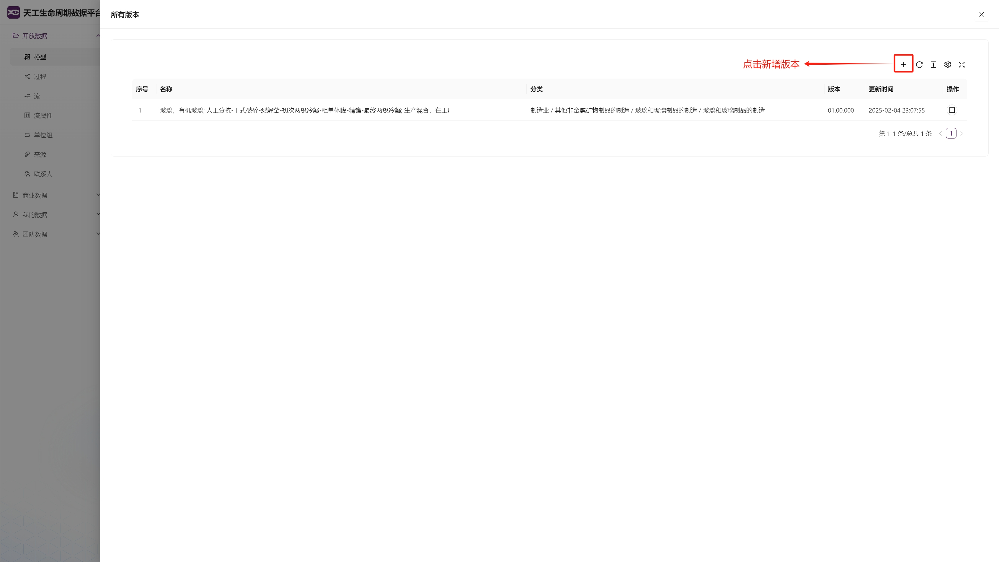

# 开放数据与商业数据

## 数据对比
| 数据类型   | 组成要素                                   | 用户权限       | 内容                                                                 |
|------------|--------------------------------------------|----------------|--------------------------------------------------------------------------|
| 开放数据   | 过程、流、流属性、单位组、来源、联系人、模型 | 查看/引用     |经过平台审核的标准化生命周期评估数据集 |
| 商业数据   | 过程、流、流属性、单位组、来源、联系人      | 查看     | 商业化生命周期评估数据集的元数据信息（描述性信息）|

>说明：  
两类数据**均不支持直接修改**，如需调整数据信息，需先将目标数据保存至[“我的数据”](./create-my-data.md)模块，再进行修改，然后在[“我的数据”](./create-my-data.md)模块进行引用。

## 数据操作

所有操作均以开放数据为例。

### 页面说明

**数据集页面**

在主页面点击“开放数据”展开类型列表，选择想要查看或引用的类型，点击后将跳转至相应页面，用户可在该页面查看完整数据信息，并进行数据引用。

**所有版本页面**

在数据集列表点击“所有版本”键，可跳转至“所有版本”页面，用户可在该页面查看历史版本信息或进行版本新建。

### 查看数据

**当前数据查看**  

点击列表右侧“查看”键，可查看数据的全维度信息。包含[地理位置坐标](./appendix.md#地理位置分类表)、时间戳范围、系统边界、输入输出清单等，其[过程](./appendix.md#过程分类数据集)与[流](./appendix.md#流分类数据集)覆盖多个行业与产品。

**历史数据查看**

在“所有版本”页面，可查看数据的所有历史版本。点击页面列表右侧的“查看”键可查看历史数据的详细信息。

### 复制数据

**方法一**  

1. 点击“复制数据”，弹出“复制信息”页面，弹出页面后点击“保存”。
2. 在数据平台-“我的数据”中找到对应的数据副本，在此对其进行修改（具体操作指引详见[我的数据](./create-my-data.md)）。

**方法二** 

1. 在“所有版本”页面点击“新增版本”按钮，进入“创建版本”页面，点击“保存”。  
2. 在数据平台-“我的数据”中找到对应的数据副本，在此对其进行修改（具体操作指引详见[我的数据](./create-my-data.md)）。

>注意点：  
保存前必须更新版本号，系统会校验版本号唯一性，重复版本号将拒绝保存。

>**商业数据模块与开放数据模块的操作流程完全一致，相关操作指引请直接参考“数据操作”部分。**