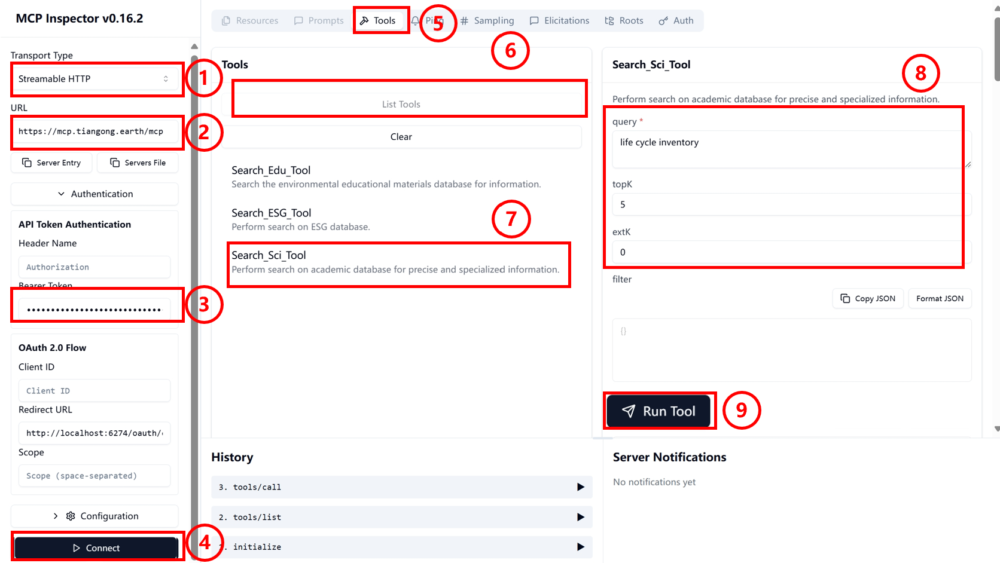

# TianGong Knowledge Base MCP

Check the [TianGong MCP Hub](https://hub.ceeai.net/) for updated knowledge-base tooling guides, scripts, and FAQs. The essentials are summarised below.

## Remote Authentication

### API Key

To obtain an API Key, please contact the Environmental Data Science and Systems Engineering team at Tsinghua University.

## MCP Server Invocation

### Inspector

MCP Inspector Launch: Enter the following command in the terminal, which will automatically redirect to the Inspector page.

```bash
npx @modelcontextprotocol/inspector
```

1. Transport Type Configuration: On the Inspector page, click the dropdown box and select Streamable HTTP.  
2. URL Configuration: Fill in the MCP Server port [https://mcp.tiangong.earth/mcp](https://mcp.tiangong.earth/mcp).  
3. Token Configuration: Enter the API Key obtained from the above process into the corresponding token field.
4. Server Connection: Click connect to establish connection.

    **After successful page connection**, the following demonstrates the application method using search as an example.  
5. Operation Selection: Click the Tools button on the top toolbar of the page.  
6. List Expansion: Click the List Tools button to display the dropdown list.  
7. Tool Selection: Click the Search_Sci_Tool button in the list.  
8. Search Configuration: Enter search information in the corresponding box and configure the retrieved content accordingly.  
9. Tool Execution: Click Run Tool to execute the tool and display output.  

    

### Cherry Studio

At the [Cherry Studio official website](https://www.cherry-ai.com/download), follow the [official documentation](https://docs.cherry-ai.com/pre-basic/installation) to download the software to your local machine and open it.

1. Open Settings Panel: Click the settings button in the sidebar to open the panel.  
2. Open MCP Settings: Select MCP Settings to navigate to the MCP configuration interface.  
3. Add MCP Server: Click the Add Server button in the upper right corner to navigate to the MCP Server configuration interface.  

    

4. Information Filling: Configure basic information for the local MCP Server (XXX in Headers is the obtained API Key).

    >Type: Streamable HTTP  
    >URL: [https://mcp.tiangong.earth/mcp](https://mcp.tiangong.earth/mcp)  
    >Headers:  
    >Content-Type=application/json  
    >Authorization=Bearer XXX

5. Save Information: Click the "Save" button to save settings.
6. Start MCP Connection: Click to open the MCP Server.

      

7. Open Chat Interface: Click the top button in the sidebar to return to the main page. Configure the model (refer to [official documentation](https://docs.cherry-ai.com/pre-basic/providers)) and create a chat page.  
8. Server Connection: Click the MCP Settings button below the conversation.  
9. MCP Selection: Select the required MCP.

      

### Dify

1. Tools Page Access: Click the "Tools" option in the top toolbar to navigate to the tool management page.  
1. MCP Tool Search: Enter "MCP" keyword in the search bar to search.  
1. Tool Market Download: Find and download the MCP tool in the Market place (the highlighted tool in the figure is the recommended tool).  
1. Tool Installation Execution: Click the "Install" button to complete MCP tool installation.  

    
1. Configuration Panel Opening: After MCP tool installation is complete, click the pop-up configuration panel.  
1. Authorization Configuration Access: Click "Authorization" to configure MCP authorization.  
1. Configuration Window Opening: Click to open the MCP detailed configuration window.  
1. Basic Information Filling: Fill in necessary connection information in the configuration window. (Example below)

    ```json
    {
        "tiangong_kb_remote": {
        "transport": "streamable_http",
        "url": "https://mcp.tiangong.earth/mcp  ",
        "headers": {
            "Accept": "application/json,text/event-stream",
            "Authorization": "Bearer XXX"
        },
        "timeout": 50,
        "sse_read_timeout": 50
        }
    }
    ```

1. Configuration Information Saving: Click the "Save" button after completing the form.  

      

1. Workflow Construction: Build workflows or agents in Dify to invoke MCP.  
    >
    >1. For creating agents and workflows, refer to [official documentation](https://docs.dify.ai/zh-hans/guides/application-orchestrate/creating-an-application).
    >2. For MCP applications, refer to [official documentation](https://docs.dify.ai/zh-hans/guides/tools/mcp)
