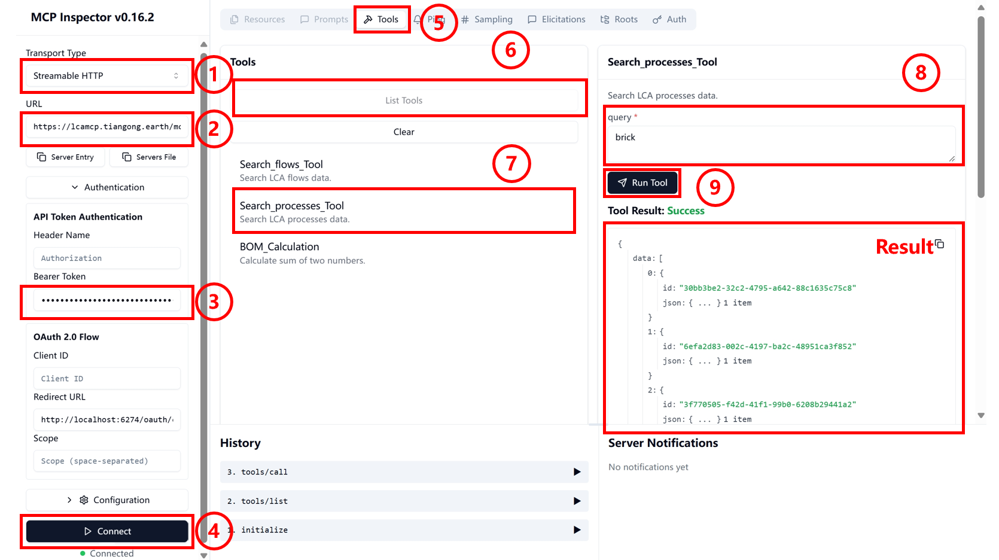

# TianGong LCA MCP(Remote)

## Remote Authentication

Remote access requires Bearer token authentication. Currently, there are two main methods to obtain Bearer tokens: through **OAuth 2.0 Flow** and through **Tiangong Life Cycle Data Platform**.

### Tiangong Life Cycle Data Platform

Log in to the [Tiangong Life Cycle Data Platform](https://lca.tiangong.earth). For user registration and login guidance, please refer to the [official documentation](https://docs.tiangong.earth/quick-start/first-login). After successfully opening the page, perform the following operations.  

1. Personal Information Expansion: Click on the personal name in the upper right corner of the top toolbar to display a dropdown box.
2. Account Information Selection: Select "Account Information" from the dropdown box to navigate to the account information page.
3. API Key Generation: Click the "Generate API Key" button in the right sidebar.
4. Password Verification: Enter the platform password in the popup box for verification.
5. Key Acquisition: Click the "Generate Key" button to successfully obtain the API Key.

    

### OAuth 2.0 Flow

1. OAuth Interface Access: Open the [Tiangong MCP Server OAuth Authentication Demo interface](https://lcamcp.tiangong.earth/oauth/demo).
2. Authorization Process Initiation: Scroll down the page, find the "Start OAuth Flow" button, and click to begin authorization.
3. User Login Verification: Log in using the username and password registered on the Tiangong Life Cycle Data Platform.
4. Authorization Code Acquisition: After successful login, obtain the Authorization Code and copy it for safekeeping.
5. Window Closure: Click the "close windows" button to return to the main interface.
6. Authorization Code Exchange: Paste the copied Code into "Exchange Authorization Code" at the bottom of the page, click the "Exchange for tokens" button to obtain Access token and Refresh token.  
      

## MCP Server Invocation

### Inspector

MCP Inspector Launch: Enter the following command in the terminal, which will automatically redirect to the Inspector page.  

    ```bash
    npx @modelcontextprotocol/inspector
    ```

1. Transport Type Configuration: On the Inspector page, click the dropdown box and select "Streamable HTTP".
2. URL Address Configuration: Fill in the MCP Server port address in the URL field: [https://lcamcp.tiangong.earth/mcp](https://lcamcp.tiangong.earth/mcp).
3. Token Configuration: Enter the Access token or API Key obtained from the above process into the corresponding token field.
4. Server Connection: Click the "connect" button to establish connection.  

    **After successful page connection**, the following demonstrates the application method using process search as an example.  

5. Tool Operation Selection: Click the "Tools" button on the top toolbar of the page.
6. Tool List Expansion: Click the "List Tools" button to display the dropdown tool list.
7. Search Tool Selection: Click the "Search_processes_Tool" button in the list.
8. Search Parameter Configuration: Enter the process keywords you want to search for in the corresponding input box.
9. Tool Execution: Click the "Run Tool" button to execute the tool and view the search output results.

    

### Cherry Studio

At the [Cherry Studio official website](https://www.cherry-ai.com/download), follow the [official documentation](https://docs.cherry-ai.com/pre-basic/installation) to download the software to your local machine and open it.

1. Settings Panel Opening: Click the settings button in the sidebar to open the settings panel.
2. MCP Settings Access: Select "MCP Settings" option to navigate to the MCP configuration interface.
3. MCP Server Addition: Click the "Add Server" button in the upper right corner to navigate to the MCP Server configuration interface.

    

4. Server Information Filling: Configure basic information for the remote MCP Server (XXX in Headers is the obtained Access token or API Key).

    >Type: Streamable HTTP  
    >URL: [https://lcamcp.tiangong.earth/mcp](https://lcamcp.tiangong.earth/mcp)  
    >Headers:  
    >Content-Type=application/json  
    >Authorization=Bearer XXX  

5. Configuration Information Saving: Click the "Save" button to save all settings.
6. MCP Connection Startup: Click the startup button to open the MCP Server connection.
  
    

7. Chat Interface Creation: Click the top button in the sidebar to return to the main page. Configure the model (refer to [official documentation](https://docs.cherry-ai.com/pre-basic/providers)) and create a chat page.  
8. Server Connection Configuration: Click the "MCP Settings" button below the conversation box.
9. MCP Service Selection: Select the required MCP server from the popup options.  

    

### Dify

1. Tools Page Access: Click the "Tools" option in the top toolbar to navigate to the tool management page.  
1. MCP Tool Search: Enter "MCP" keyword in the search bar to search.  
1. Tool Market Download: Find and download the MCP tool in the Market place (the highlighted tool in the figure is the recommended tool).  
1. Tool Installation Execution: Click the "Install" button to complete MCP tool installation.  

    
1. Configuration Panel Opening: After MCP tool installation is complete, click the popup configuration panel.  
1. Authorization Configuration Access: Click "Authorization" to configure MCP authorization.  
1. Configuration Window Opening: Click to open the MCP detailed configuration window.  
1. Basic Information Filling: Fill in necessary connection information in the configuration window. (Example below)

    ```JSON
    {
        "tiangong_lca_remote": {
        "transport": "streamable_http",
        "url": "https://lcamcp.tiangong.earth/mcp  ",
        "headers": {
            "Accept": "application/json,text/event-stream",
            "Authorization": "Bearer XXX"
        },
        "timeout": 50,
        "sse_read_timeout": 50
        }
    }
    ```

1. Configuration Information Saving: Click the "Save" button after completing the form.

      

1. Workflow Construction: Build workflows or agents in Dify to invoke MCP.  
    >
    >1. For creating agents and workflows, refer to [official documentation](https://docs.dify.ai/zh-hans/guides/application-orchestrate/creating-an-application).
    >2. For MCP applications, refer to [official documentation](https://docs.dify.ai/zh-hans/guides/tools/mcp)
