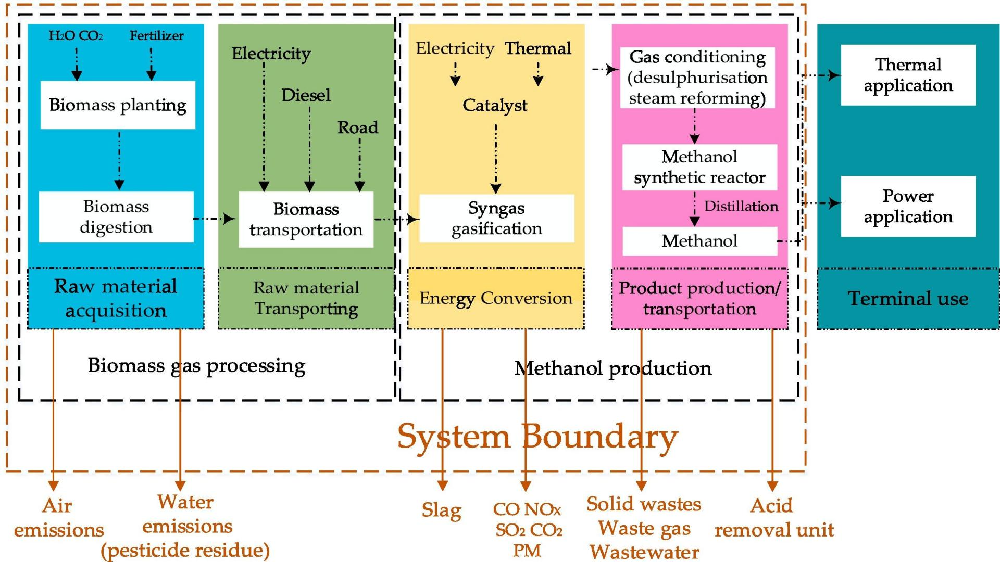

# Data Evaluation

For data collection guidelines, refer to [Data Collection Instructions](/en/data-collection/data-collection-instructions)

This case study is based on the literature [Comparative environmental assessment of methanol production technologies](https://doi.org/10.1016/j.enconman.2024.118128), demonstrating how to extract data from literature, preprocess it, and establish a lifecycle model for biomass-to-methanol production in the TianGong LCA Data Platform.

> Notes:  
Red borders indicate special attention points and requirements, blue borders show reference examples.
---

## Data Availability Assessment

Before modeling, assess the selected data's availability, focusing on input-output material balance. If imbalances exist, analyze reasons based on literature descriptions or process knowledge, and determine if reasonable adjustments (completion, normalization, estimation) can be made to meet modeling requirements. If not, discard the data.

- **Methanol Production Pathway Data Availability Assessment**

| ID | Pathway Name               | Data Availability | Unavailability Reason |
|----|---------------------------|-------------------|----------------------|
| 1  | Coal Gasification to Methanol | ✅ Available | — |
| 2  | Coal Coking to Methanol | ⚠ Partially Available | Output exceeds input in coal mining/processing; coal production and methanol process data available |
| 3  | Natural Gas to Methanol | ❌ Unavailable | Large input-output discrepancy, material imbalance, cannot be corrected - excluded |
| 4  | Biomass to Methanol (BOTM) | ✅ Available | — |
| 5  | CO₂ Capture to Methanol | ✅ Available | — |

Selected **Biomass to Methanol (BOTM)** as the example case.

## Process Flow Diagram

The literature provides a complete process flow diagram with clear system boundaries, suitable for direct modeling reference.

See literature Fig. 6. System boundary of methanol production from biomass.

## Data Processing

Material/energy flows extracted from literature:

**Combining the flow diagram and data content, this case modelling includes two levels: [Unit Process Construction](/en/data-collection/case-introduction/unit-process-construction) (three single processes) and [Model Building](/en/data-collection/case-introduction/model-building)**

Each sub-process requires specifying:

- **Reference flow**:
  - Biomass processing: 1kg treated biomass
  - Biomass gasification: 1kg CO  
  - Methanol synthesis: 1kg methanol
- Ensure consistent reference quantities across all processes for correct system calculations

The overall model is a partially terminated system, with the third unit process [Methanol Production] as the baseline. Functional unit set as 1 kg methanol product (or 1 ton - modeler's choice, but must maintain consistency across unit processes).

**Processing Notes:**

- **Missing data**: Wastewater amount not provided—estimated based on material balance (details in [Unit Process Construction](/en/data-collection/case-introduction/unit-process-construction)).

> Important Note:
When required units differ from flow units, perform **unit conversion** rather than creating new Flow items.
