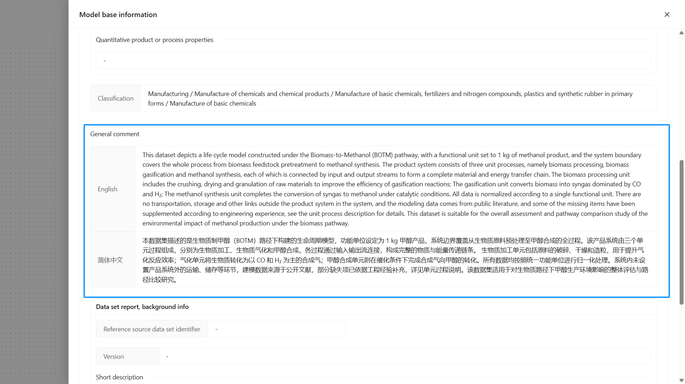

# Partially Terminated System Modeling

This section should outline the overall system structure composed of three unit processes and briefly explain their integration in the lifecycle model. The corresponding lifecycle model diagram should also show the connection relationships between these three unit processes, reflecting complete material and energy flow paths within the system boundary.

Platform modeling reference:

- [Create New Data - Create Model](/i18n/en/docusaurus-plugin-content-docs/current/user-guide/create-my-data.md#creating-a-model)

## Modeling Demonstration

Basic information overview reference:

## Additional Modeling Considerations

### Note Unit Process Connections

For [CO₂ Capture to Methanol] modeling, the unit process connections are as follows:

