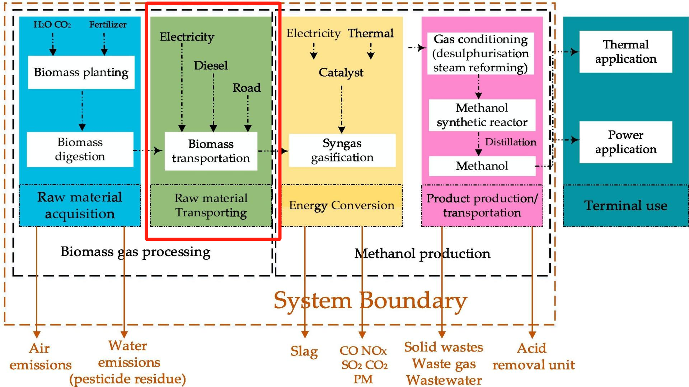
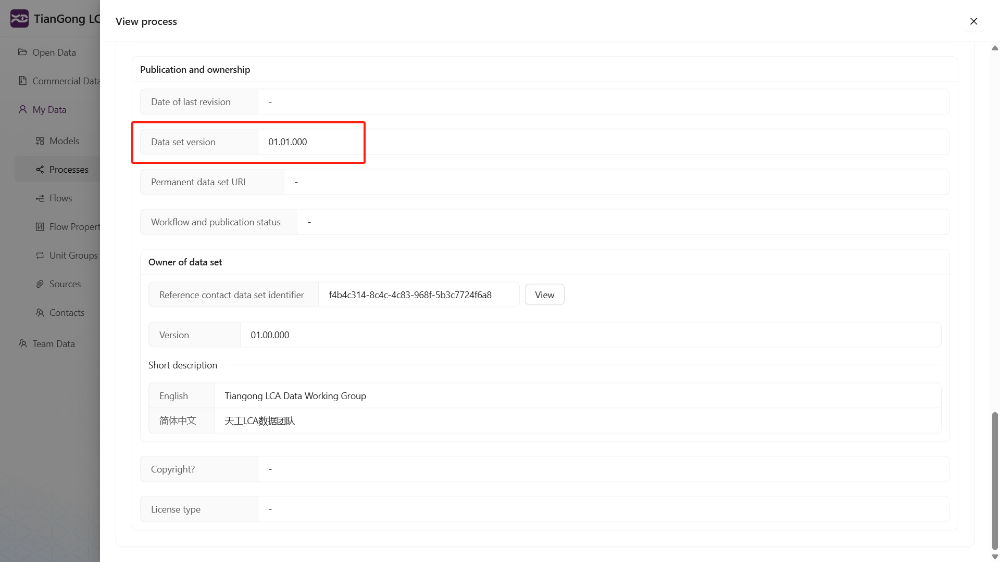
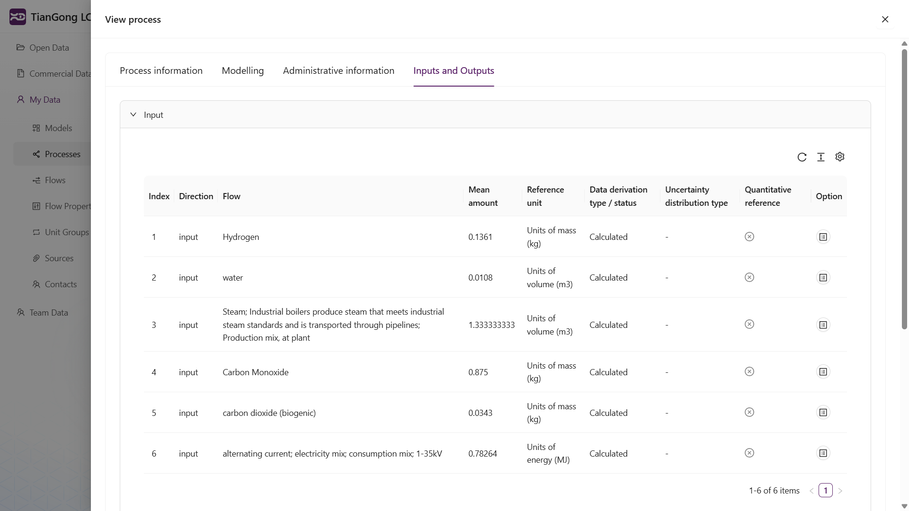
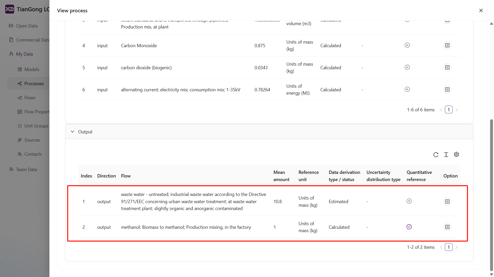
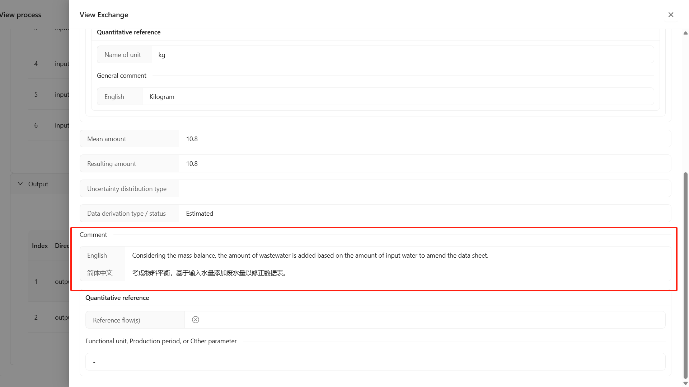
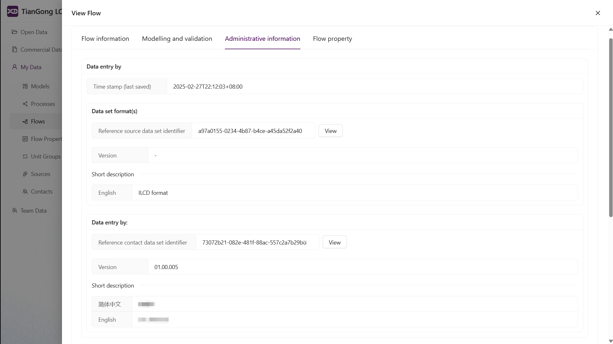

# Unit Process Construction

Reference for platform operations: [Create New Data - Create Process](/user-guide/create-my-data#create-process)

## Process Information

### Basic Name/Processing, Standards, Route/Mixing and Location Type/Quantitative Product or Process Attributes

**[Biomass Processing]** Biomass processing; Pretreatment, granulation, drying; Production mixing, at plant

See literature: "First, biomass is subjected to necessary pretreatment, which includes granulation and drying."

**[Biomass Gasification]** Biomass gasification; Feedstock gas condensation; Production mixing, at plant

See literature: "Subsequently, biomass gasification produces feedstock gas consisting mainly of CO, H₂, CO₂, and CH₄. Condensation is then employed to extract the fuel gas from the reactor."

**[Methanol Production]** Methanol production; Biomass-to-methanol; Production mixing, at plant; Methanol mass fraction > 99%

See literature: "The purified syngas is compressed and added to the methanol synthesizer in the last step, where a catalyst helps to produce crude methanol."

Although the literature doesn't directly specify product concentration in the current unit process description, it clearly states elsewhere that the final methanol product must meet the "methanol mass fraction > 99%" standard. Therefore, this can be included as supplementary product standard information in the methanol production process naming.

**Naming should combine process descriptions or technical flowcharts from literature to extract processing methods, product standards and technical pathways, ensuring accurate and representative naming.**

**If literature doesn't provide concentration information for methanol product in this process, consider supplementing from other public literature or industry reports. For final products, try to supplement key quantitative attributes like concentration, temperature; for intermediates, this isn't mandatory if not mentioned in literature.**

Examples of clearly given quantitative attributes:

**[Coal Coking to Methanol]**: Coal production; Hard coal pyrolysis in coke oven; Production mixing, at plant; ~1100°C

**[CO₂ Capture to Methanol]**: CO₂ capture; Direct air capture (DAC) technology; Production mixing, at plant; CO₂ concentration 99.5%~99.7%

> Note:
All fields require both Chinese and English names to ensure multilingual model compatibility.

### Dataset General Description

Using [Biomass Processing] as example:

The general description should combine process characteristics, specific descriptions from literature and data properties to fully reflect the unit process's positioning, functional role, technical details, data sources, emission explanations and applicability.

**Temporal Representativeness**
Reference year: 2020-2023

Note: Literature doesn't specify exact data collection or simulation time points/periods. Considering publication year (2024) and absence of future scenario modeling, data is presumed representative of 2020-2023 industry averages, suitable for current process LCA.

### Geographic Representativeness

CN (China)

Explicitly stated in literature.

### Flowchart or Process Diagram

Although literature provides complete system boundary diagram, current modeling focuses on single processes, so extract relevant portions from original diagram or create simplified flowcharts based on literature descriptions to accurately show boundaries and input-output relationships.

### Modeling Information

### LCI Method and Allocation

Dataset type: Unit process, single operation

Because this process cannot be further divided into finer operational steps during data collection phase.

Data sources used: Select the literature file in [Sources].

### Management Information

Based on interface module content, select existing data sources; if none match, may leave unselected.

Below shows dataset collector/recorder/version number entries.

### Input/Output

Calculate relative values for each input/output item based on determined reference flows and quantities, ensuring data matching and unit consistency.

**[Biomass Processing]**

Note: Reference flow requires quantity reference selection.

**[Biomass Gasification]**

Current process shows input-output imbalance mainly because boiler water is internally recycled, not counted as final emission in output flow. Must explain in remarks to clarify material balance logic.

Example: <u>Boiler water is reused through closed-loop recycling (e.g., gasification, synthesis, condensation reuse). Most input water participates in internal chemical reactions and energy transfer, ultimately being purified and reintroduced to the process, thus water "consumption" isn't separately listed in outputs.</u>

---

**[Methanol Production]**

Current process shows input-output imbalance. To satisfy material balance, wastewater item is added based on input water volume as corresponding output flow to balance overall mass flow. Must explain in remarks.

Example: <u>Considering material balance, wastewater amount is added based on input water volume to correct data table.</u>

### Creating New Flows

For [Methanol Production] process, new flow required: **Methanol; Biomass-to-methanol; Production mixing, at plant; Methanol mass fraction > 99%**

New methanol flow name determined based on cited literature descriptions.

Reference for creating new flows: [Create New Data - Create Flow](/user-guide/create-my-data#create-flow)

To enhance flow data applicability and completeness, suggest supplementing multiple unit forms when filling flow properties. For standard chemical products like methanol, reference authoritative sources or literature to add key parameters like density, calorific value, supporting different modeling needs (mass, volume, energy). **Select one unit as reference quantity.**

---

## Additional Unit Process Considerations

**Input or output flows cannot contain duplicate flows (judged by UUID). If encountered, merge and add explanatory notes.**

**[CO₂ Capture]**

Natural gas for gas turbine and natural gas for calciner data must be merged.

Example: <u>33.33% for gas turbine, 66.67% for calciner.</u>

