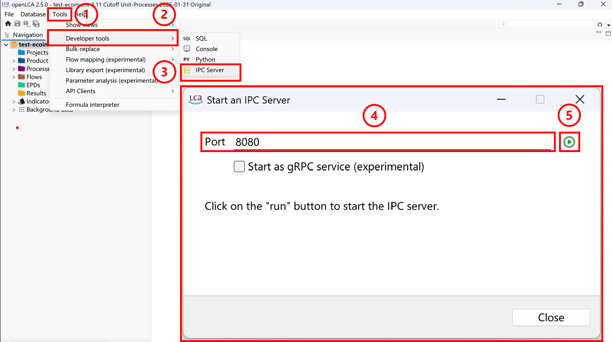
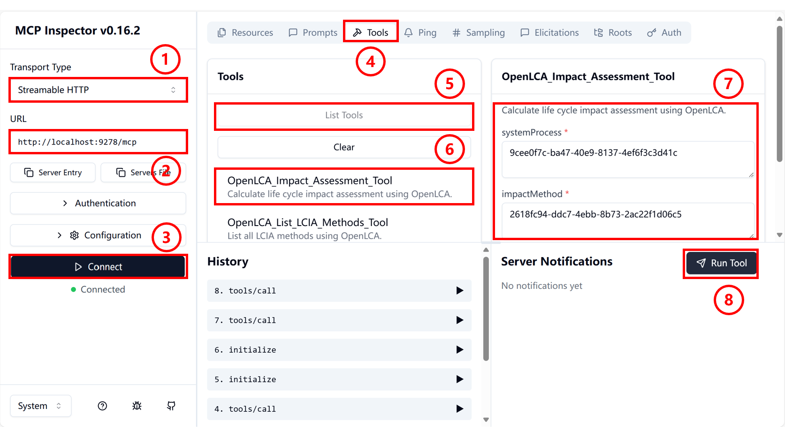
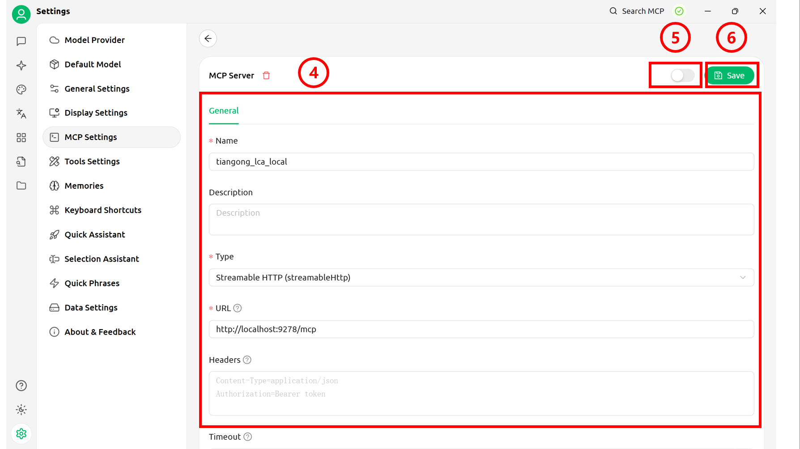
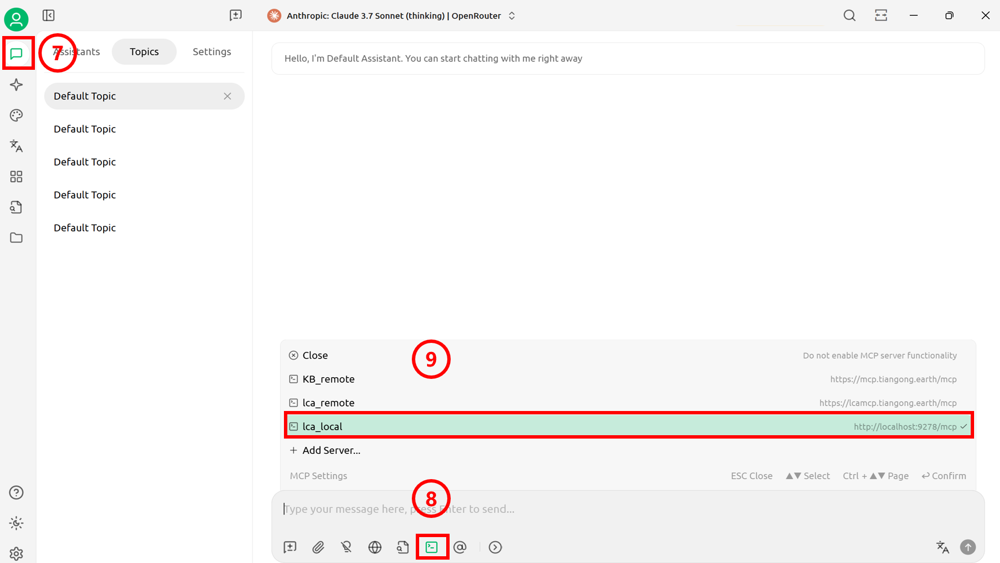

# TianGong LCA MCP(Local)
## OpenLCA Configuration
### OpenLCA Installation
At the [openLCA official website](https://www.openlca.org/download), follow the page instructions to download the openLCA software to your local machine.  
### File Import
**Click the software icon to enter the downloaded openLCA interface and begin file import**  
1. Menu Expansion: Click the "File" menu in the upper left corner to expand the dropdown list.  
2. Select Import: In the menu, click the "Import" option to prepare for importing data files.  
3. Import File: In the "Import" submenu, select "File" or "Other" based on the actual data format.

| Import Option | Purpose                             | Common Supported Formats/Types                                      |
| :------------ | :--------------------------------- | :------------------------------------------------------------------- |
| **File**      | Import complete databases or standard dataset files. | `.zolca`, `EcoSpold`, `ILCD`, `SimaPro CSV`, `Excel`   |
| **Other**     | Import specific components or perform advanced import configuration. | Import entire databases, specific components (processes, flows, methods, etc.), `GeoJSON`, mapping files |
4. Browse Data: After import completion, expand and view data in the main interface navigation bar.  

  

### IPC Server
1. Menu Expansion: Click the "Tools" menu in the upper left corner to expand the dropdown list.  
2. Tool Selection: In the menu, click the "Developer tools" option.  
3. Open Configuration Panel: In the "Developer tools" submenu, select "IPC Server".    
4. Port Configuration: Navigate to the "Start an IPC Server" interface, fill in the IPC Server startup port in the Port field (recommended: 8080).  
5. Service Startup: Click the green button to start the IPC Server.  

  
## MCP Server
### NVM Installation
Depending on your system type, download nvm to your local machine from the corresponding official website ([Windows](https://github.com/coreybutler/nvm-windows/releases), [Linux, macOS](https://github.com/nvm-sh/nvm)) following the documentation.  
### Node.js Package
**Open the corresponding terminal based on your computer's system (Windows/Linux/Mac) and enter the appropriate commands following the instructions below**  
1. Node.js Download/Activation  
```bash
# Install Node.js version 22
nvm install 22
# Configure the Node.js version to use
nvm use <version>
```
2. MCP-Server Package Installation  
```bash
# Install package
npm install -g @tiangong-lca/mcp-server@0.0.14
```
3. MCP-Server Startup  
```bash
# Start MCP-Server
npx -p @tiangong-lca/mcp-server tiangong-lca-mcp-http-local
```
## MCP Server Invocation
### Inspector
**MCP Inspector Launch: Enter the following command in the terminal, which will automatically redirect to the Inspector page**  
```bash
npx @modelcontextprotocol/inspector
```
1. Transport Type Configuration: On the Inspector page, click the dropdown box and select Streamable HTTP.  
2. URL Configuration: Fill in the MCP Server port http://localhost:9278/mcp.  
3. Server Connection: Click connect to establish connection    

**After successful page connection, the following demonstrates the application method using environmental impact assessment as an example**  
4. Operation Selection: Click the Tools button on the top toolbar of the page.  
5. List Expansion: Click the List Tools button to display the dropdown list.  
6. Tool Selection: Click the OpenLCA_Impact_Assessment_Tool button.  
7. UUID Configuration: Find the UUID corresponding to systemProcess and impactMethod in openLCA and enter them in the corresponding boxes.  
8. Tool Execution: Click Run Tool to execute the tool and display output.  


**Calculation results as shown in the figure**  


### Cherry Studio
**At the [Cherry Studio official website](https://www.cherry-ai.com/download), follow the [official documentation](https://docs.cherry-ai.com/pre-basic/installation) to download the software to your local machine and open it.**
1. Open Settings Panel: Click the settings button in the sidebar to open the panel.  
2. Open MCP Settings: Select MCP Settings to navigate to the MCP configuration interface.  
3. Add MCP Server: Click the Add Server button in the upper right corner to navigate to the MCP Server configuration interface.  

  
4. Information Filling: Configure basic information for the local MCP Server.  
>Type: Streamable HTTP  
>URL: http://localhost:9278/mcp
5. Save Information: Click the "Save" button to save settings.
6. Start MCP Connection: Click to open the MCP Server.

  
7. Open Chat Interface: Click the top button in the sidebar to return to the main page. Configure the model (refer to [official documentation](https://docs.cherry-ai.com/pre-basic/providers)) and create a chat page.  
8. Server Connection: Click the MCP Settings button below the conversation.  
9. MCP Selection: Select the required MCP.  

  
<video src="img/1.mp4" controls width="600">
  Your browser does not support video playback.
</video>

### Dify
**Follow the dify [official documentation](https://docs.dify.ai/zh-hans/getting-started/install-self-hosted/readme) to deploy locally. After deployment is complete, start the project and perform the following operations**  

1. Tools Page Access: Click the "Tools" option in the top toolbar to navigate to the tool management page.
2. MCP Tool Search: Enter "MCP" keyword in the search bar to search.
3. Tool Market Download: Find and download the MCP tool in the Market place (the highlighted tool in the figure is the recommended tool).
4. Tool Installation Execution: Click the "Install" button to complete MCP tool installation.
