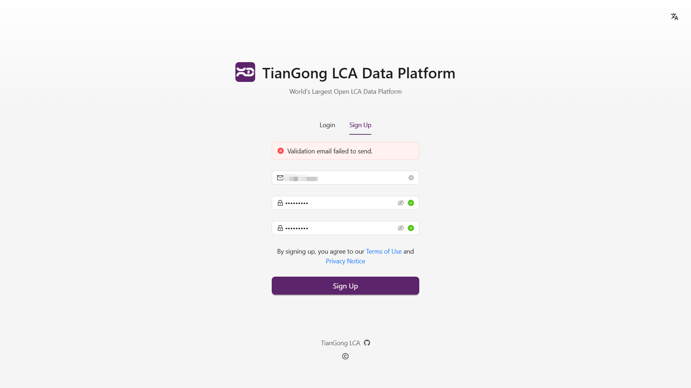

# Registration and Login

## Email Verification Failure Troubleshooting

If you encounter email verification failures during registration or login, please refer to the following troubleshooting steps:

1. **Incorrect Email Address**: Ensure the email address is entered correctly, avoiding case sensitivity issues, full-width/half-width character mix-ups, or input method interference.
2. **Password Requirements Not Met**: For security purposes, passwords must meet certain criteria. Simple passwords are not allowed, and Chinese punctuation is not supported. We recommend using a combination of letters, numbers, and standard English symbols.
3. **Email Provider Issues**: Try using alternative email providers such as `@qq.com`, `@163.com`, `@126.com`, `@sina.com`, or university emails ending with `.edu` or `.edu.cn`. Corporate or international email addresses may face service blocks or domain restrictions.
4. **Unstable Network Connection**: Weak network conditions may cause request failures. Try switching to a more stable network.
5. **Browser Issues**: Clear your browser cache or try a different browser before attempting verification again.

If problems persist after following these steps, please contact our support team at [contact@tiangong.earth](mailto:contact@tiangong.earth) with detailed information for further assistance.
