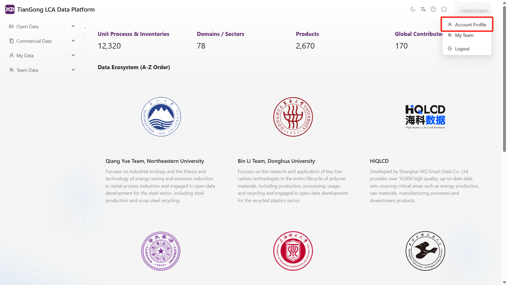
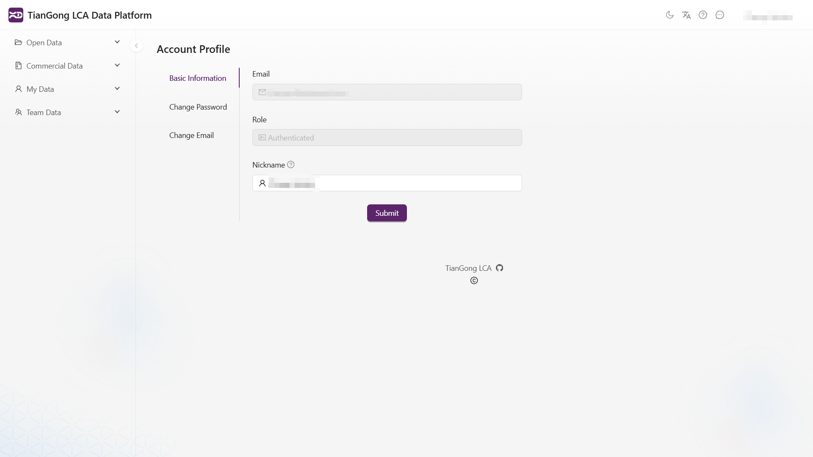

# Account Management

Click your username in the top-right corner and select **Account Profile** to view and modify your account information.

**Account Profile** contains three sections: **Basic Information**, **Change Password**, and **Change Email**:

## Basic Information

This section displays your current email, role, nickname and other details. You can edit your nickname here. After editing, the information displayed in the top-right corner (default is your registered email) will immediately update to your new nickname.

## Change Password

The system saves your initial password by default. Simply enter and confirm your new password to complete the change.

## Change Email

The system displays your current registered email. Enter and confirm your new email address to complete the modification.

