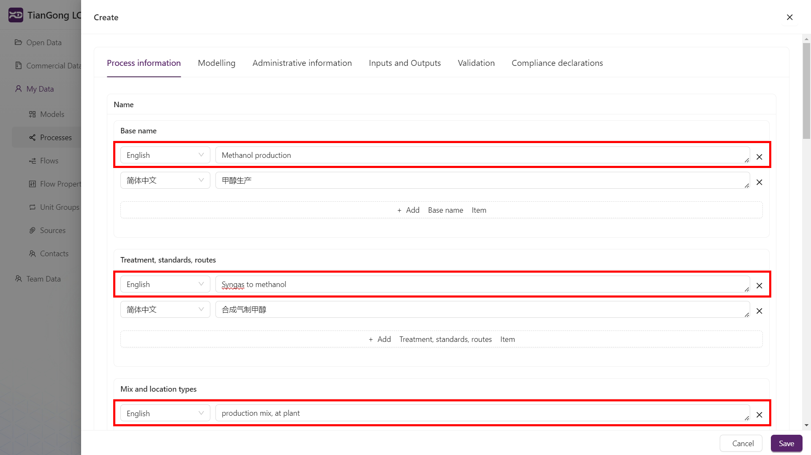
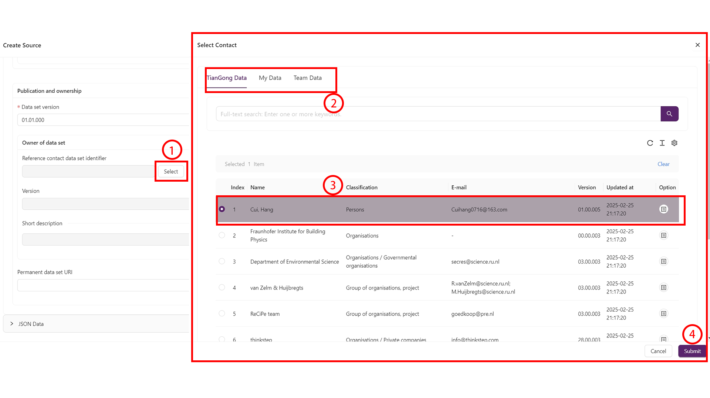
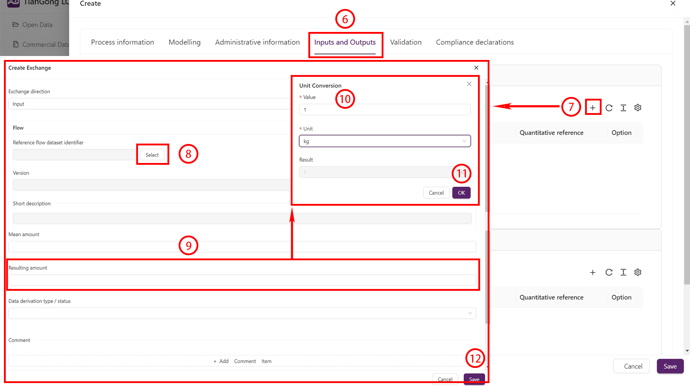
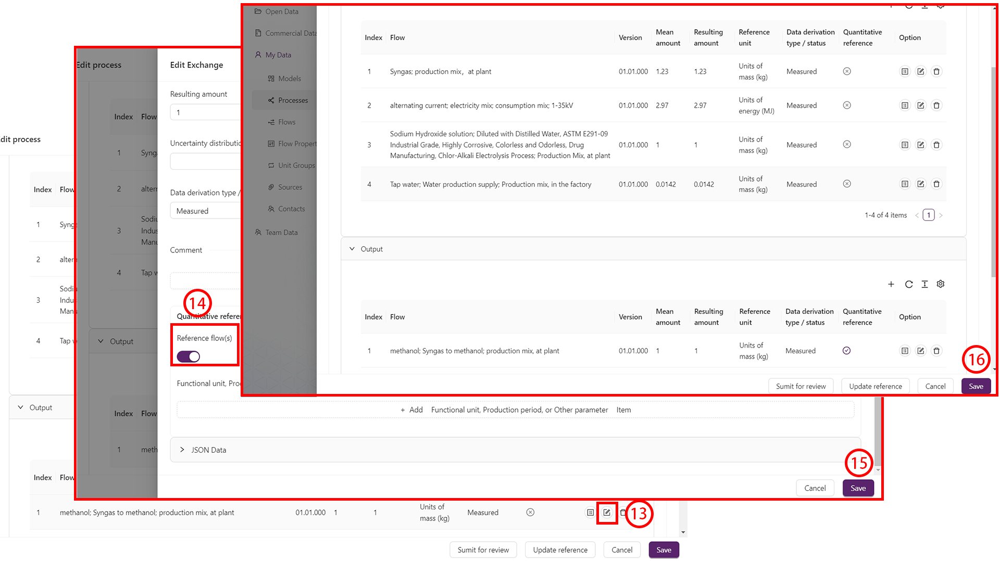
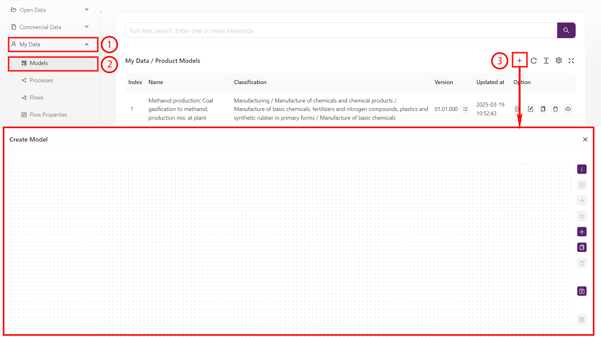
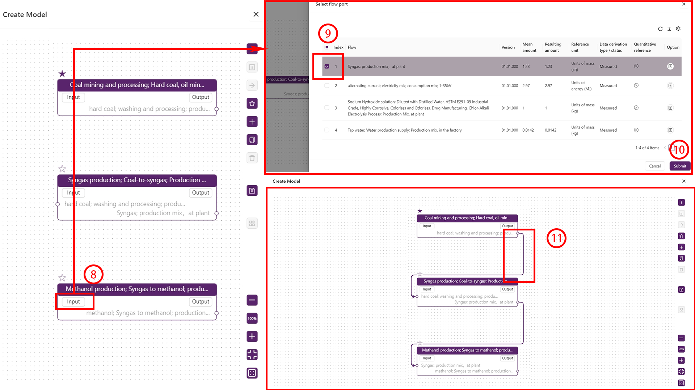
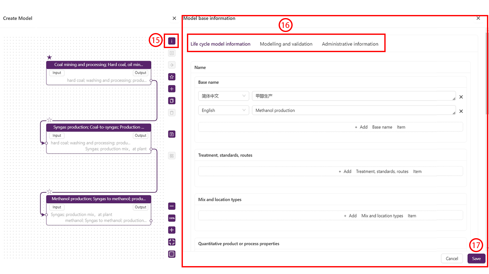
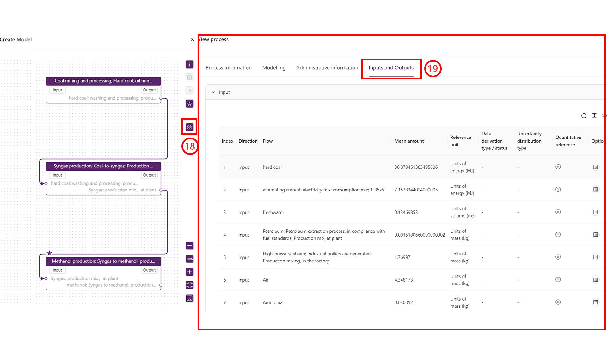
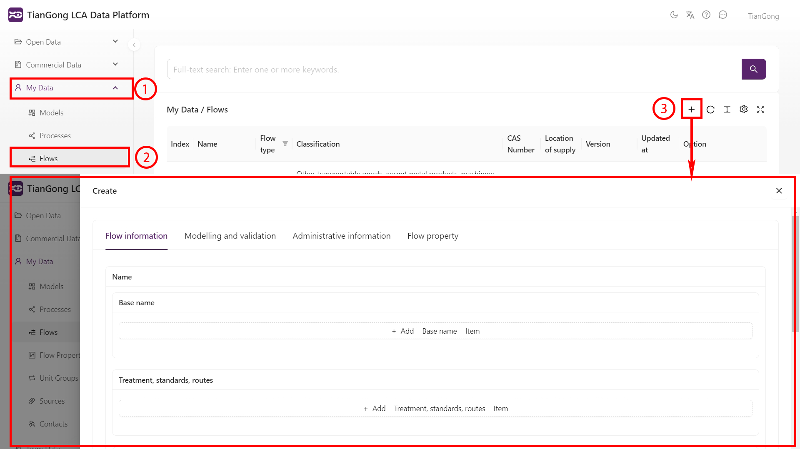

# Creating Data

The Tiangong LCA Data Platform allows users to independently create and manage data. Users can perform data creation, editing and deletion operations in the "My Data" module. This document details the workflow for creating new data, including creating processes, models, flows, contacts, sources, unit groups and flow properties.

## General Rules

**1. Language Specification**  
When filling in fields with language selection options, the "English" field is mandatory. Please input content accurately according to interface prompts and ensure the selected language matches the actual content language.
  
**2. Data Selection**  
For content requiring selection like "Dataset Format" or "Compliance System Name", follow these steps:  
1. Open selection panel: Click the "Select" button next to the field to display the information panel.  
2. Switch categories: Use the top navigation bar to select target data categories, the interface will dynamically update.  
3. Select data: Check target items in the list (selected rows show purple background), with selections displayed in the left status bar.
4. Save changes: Click "Save" at the bottom of the edit page to return to the previous panel.
  
**3. Version Number**  
To prevent data loss from client exceptions, we recommend first filling in the version number and saving a draft, then re-entering the edit interface to complete other fields. Remember to manually save progress periodically during editing.

## Creating Processes and Models

Processes and models are core components of lifecycle assessment. Users can create and manage processes and models in the "My Data" module. Creating a process refers to creating a "unit process", while "partial termination systems" and "LCI results" exist as models. Models can be used as processes and will appear in both "Models" and "Processes" modules after saving. Below are detailed steps:

### Creating a Process

1. Open data panel: Locate and click "My Data" in the left navigation bar to activate the data management interface.  
2. Navigate to process directory: Select "Processes" in the hierarchical list to jump to "My Data/Processes".  
3. Initialize process framework: Click the "+" create button in the top-right to enter a blank process configuration page.  

   
4. Switch categories: Use the top navigation bar to select target data categories, the interface will dynamically update.  
5. Enter parameters: Fill in process data field by field according to prompts. Repeat step 4 until "Process Information", "Modeling Information" and "Management Information" are all completed.  

   
6. Activate flow management: Select the "Inputs & Outputs" tab to display the configuration panel.  
7. Create flow instance: Click the "+" symbol in INPUT/OUTPUT areas to open the flow creation sub-window based on data flow requirements.  
8. Bind flow dataset: Click the selection icon after "Reference Flow Identifier" to choose predefined data flows from the popup directory tree.  
9. Define flow values: Locate and fill in the value fields for flow quantities.  
10. Configure unit conversion: Open the unit conversion page, enter values and corresponding units - the system will automatically establish numerical relationships.  
11. Save conversion data: Click "Save" at the bottom to return to the previous panel.  
12. Save flow data: Click "Save" at the bottom to return. Repeat steps 7-12 until all required flows are added.  

 
13. Edit page: Find the main output flow in the OUTPUT list and click the pencil edit icon to open the flow edit page.  
14. Set reference flow: Locate and enable the "Reference Flow" switch at the bottom to designate the main output as reference flow.  
15. Save changes: Click "Save" at the bottom to return.  
16. Save process: Finally click "Save" at the bottom to complete process configuration.  

 

### Creating a Model

1. Open data panel: Locate and click "My Data" in the left navigation bar.  
2. Navigate to model directory: Select "Models" in the hierarchical list to jump to "My Data/Product Models".  
3. Initialize model framework: Click the "+" create button in the top-right to enter a blank model configuration page.  

4. Activate node editor: Click "+" in the right properties panel to open the node configuration window.  
5. Switch categories: Use the top navigation bar to select target data categories.  
6. Select node data: Check target processes in the node list (selected rows show purple background), with selections displayed in the left status bar.  
7. Submit node configuration: Click "Submit" at the bottom to close the popup and generate node diagrams on the canvas.  

8. Activate flow management: Click the "Inputs/Outputs" button on nodes to slide open the right sidebar showing related flows.  
9. Select related flows: Check target flows in the list (selected rows show purple background), with selections displayed in the right status bar.  
10. Confirm flow binding: Click "Submit" at the bottom - nodes will automatically generate corresponding input/output ports on the canvas.  
11. Create flow connections: Drag from an upstream node's output port to a downstream node's input port to generate purple data flow pipelines.  

12. Set reference process: Click the ☆ icon next to the target process name to set as reference process (solid purple ★ indicates selection).  
13. Unify reference flows: The system automatically identifies reference flows of reference processes. Verify the extracted reference flow name matches requirements, otherwise reselect. Enter target values in the quantity field as the unified reference flow for the entire model.  
14. Save reference flow: Click "Submit" on the right to complete setup. The reference process icon becomes solid purple ★ while others remain hollow ☆.  

15. Open data panel: Click the information "i" icon in the right properties bar to expand the "Model Information" panel.  
16. Switch categories: Use the top navigation bar to select target data categories and fill in model information field by field. Repeat until "Model Information", "Modeling & Validation" and "Management Information" are all completed.  
17. Save model: Click "Save" at the bottom to return.  

18. Open data panel: Click the building blocks icon to expand the "Model Results" panel.  
19. View results: Select "Inputs & Outputs" in the top navigation bar to view final results.  

>Note:  
Models composed of multiple unit processes can be treated as new comprehensive processes. After creation, models can be used as processes and called in "My Data" > "Processes".

## Creating Flows

1. Open data panel: Locate and click "My Data" in the left navigation bar.  
2. Navigate to flow directory: Select "Flows" in the hierarchical list to jump to "My Data/Flows".  
3. Initialize flow framework: Click the "+" create button in the top-right to enter a blank flow configuration page.  

4. Switch categories: Use the top navigation bar to select target data categories.  
5. Enter parameters: Fill in flow data field by field according to prompts. Repeat until "Flow Information", "Modeling & Validation" and "Management Information" are all completed.  

6. Activate flow property management: Select the "Flow Properties" tab to display the configuration panel.  
7. Create flow property: Click the "+" symbol in the top-right to open the creation sub-window.  
8. Select flow property: Click the selection icon after "Reference Flow Property Identifier" to choose predefined properties from the popup directory tree.  
9. Define property values: Locate and fill in the average value fields.  
10. Set quantity values: Configure "Quantity Value" as needed.  
11. Save changes: Click "Save" at the bottom to return. Repeat steps 7-11 until all required properties are added.  
12. Save flow: Finally click "Save" at the bottom to complete flow configuration.  

## Creating Contacts

After creating the object, follow prompts to click through and fill in "Contact Information" and "Management Information".

>Notes:  
1. If selecting "Individual" in "Contact Information" > "Category", and the individual belongs to an organization, you can click "Select" in the "Belongs To" section to choose the affiliated team from the data group to establish the relationship.  
2. For updated data, select the previous version in "Management Information" > "Previous Dataset Version".

## Creating Sources

After creating the object, follow prompts to click through and fill in "Source Information" and "Management Information".

>Notes:  
1. Source citations must follow strict academic standards. For example, paper citations should include author, title, journal, number etc. Example: [Liu J., Zhao J., Wei H., et al., Comparative environmental assessment of methanol production technologies: A cradle-to-gate life cycle analysis[J]. Energy Conversion and Management, 2024, 302: 118128.](https://www.sciencedirect.com/science/article/abs/pii/S0196890424000694#:~:text=This%20article%20compares%20the%20state-of-the-art%20%E2%80%9Cliquid%20sunlight%E2%80%9D%20methanol,traditional%20pathways%20through%20a%20cradle-to-gate%20life%20cycle%20assessment.)  
2. Following format standards, we recommend uploading electronic documents by clicking "Upload" in "Source Information" > "Electronic Document Link" and selecting files from your computer (multiple files allowed).

## Creating Unit Groups and Flow Properties

While the Tiangong Data Platform supports user-created "Unit Groups" and "Flow Properties", please note these custom operations carry high risks that may cause unit conversion errors and lifecycle impact assessment (LCIA) calculation failures. Considering system compatibility and data accuracy, we recommend using these creation functions cautiously and generally advise against creating custom unit groups and flow properties.

### Creating Unit Groups

After creating the object, follow prompts to click through and fill in "Unit Group Information", "Modeling & Validation" and "Management Information". Then:

1. Activate unit management: Select the "Units" tab to display the configuration panel.
2. Create unit: Click the "+" symbol in the top-right to open the unit creation sub-window.
3. Define unit information: Fill in unit name, average value etc. according to prompts.
4. Set quantity values: Configure "Quantity Value" as needed.
5. Save unit: Click "Save" at the bottom to return. Repeat steps 2-5 until all required units are added.
6. Save unit group: Click "Save" at the bottom to complete unit group configuration.

  

>Note:  
The reference unit is typically the most common unit in the group (e.g. "kg" for mass, "m" for length). After determining the reference unit, enable the "Quantity Value" switch at the bottom of the "Create Unit" page for identification.

### Creating Flow Properties

**Information Entry**  
After creating the object, follow prompts to click through and fill in "Flow Property Information", "Modeling & Validation" and "Management Information".

>Notes:  
1. The selected categories in "Flow Property Classification" ("Technical Properties", "Chemical Composition", "Economic Properties", "Other Properties") should correspond with the unit group categories in "Reference Units" ("Technical Units", "Chemical Composition Units", "Economic Units", "Other Units").  
2. For updated data, select the previous version in "Management Information" > "Previous Dataset Version".
>
>**Due to cross-references during creation, the recommended workflow is: Contacts -> Sources -> Unit Groups -> Flow Properties -> Flows -> Processes -> Models**
