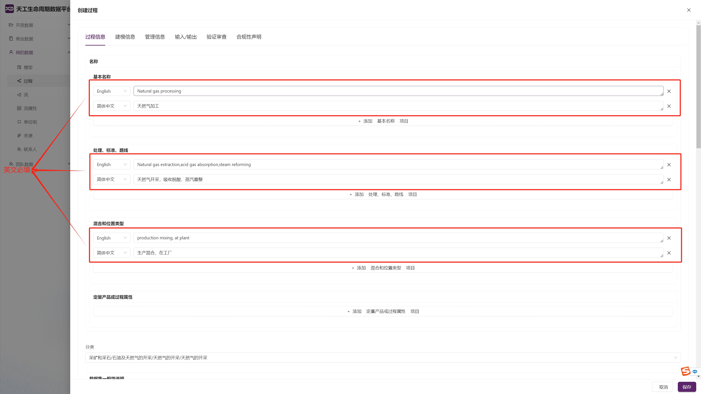
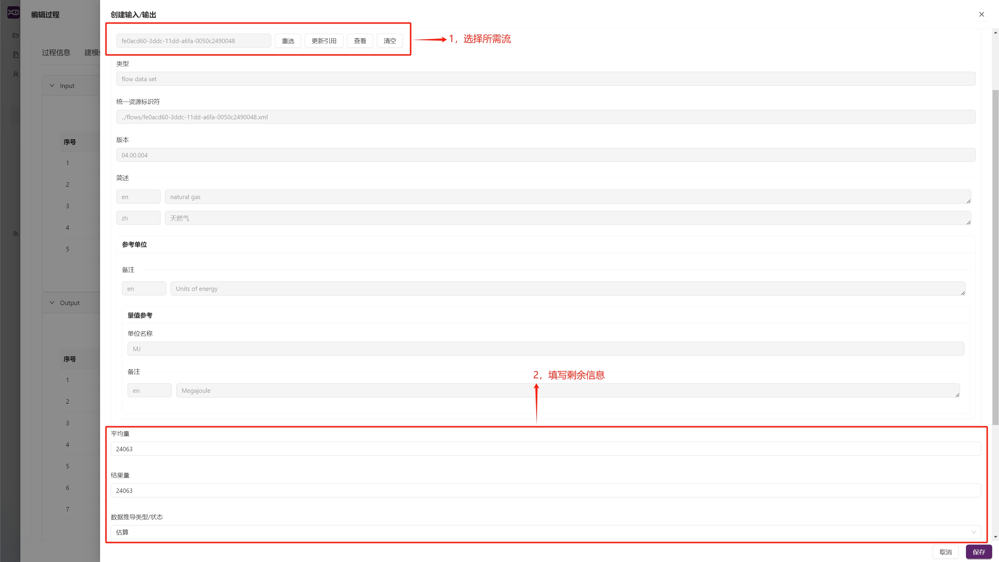
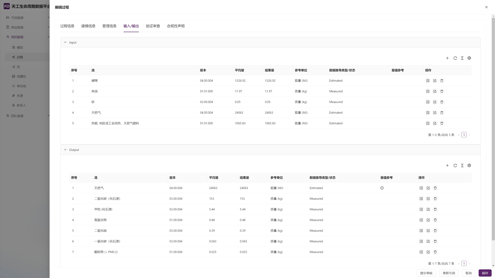
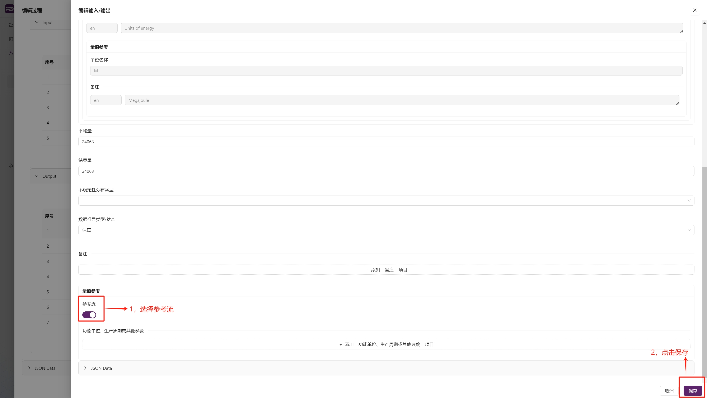
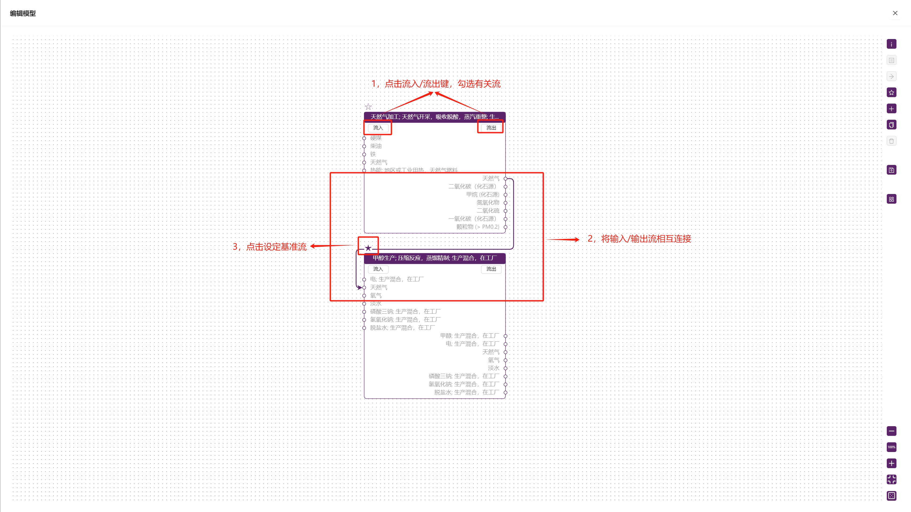
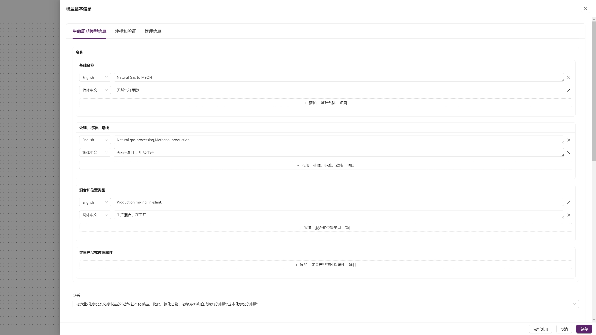
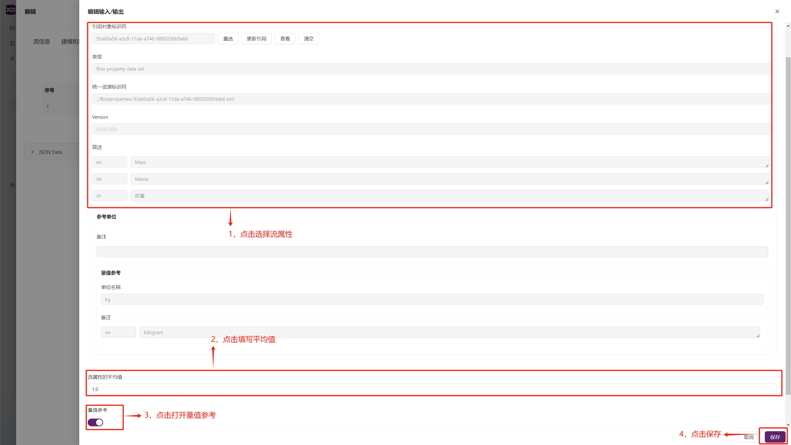

# My Data

## General Rules
**1. Creating New Data**:   
On the main page, click "My Data" to expand the type list, select the type you want to create, click to navigate to the corresponding page, then click the "+" in the upper left corner of the page to create a new object.
  
**2. Version Number**:  
After clicking "+", an information editing page will pop up. First, click "Management Information" in the upper frame section, then in "Management Information" - "Publication and Ownership", fill in the "Dataset Version". Click save afterward to avoid data loss due to user-side anomalies. The editing page will automatically return after saving. At this point, you can see that the empty dataset you created has appeared in the displayed page list. Click the "Edit" button to the right of the dataset to open the editing page again and edit the information.
  
  
>Notes:    
1. The version number consists of three sets of numbers in the format XX.XX.XXX, where the first two digits represent major updates, the middle two digits represent minor revisions and error corrections, and the last three digits are used for automatic and internal version counting during dataset development.  
2. The platform is expected to add an automatic version number filling function in the future, which will be announced separately when it goes online.

**3. Language Instructions**  
When filling in objects, if you encounter situations where language selection is required, English is always mandatory. You should fill in the content according to the prompts and ensure that the selected language matches the content.
  
**4. Selecting Data**  
For content that needs to be selected, such as "Dataset Format" and "Compliance System Name", click the "Select" button, and in the upper bar of the pop-up page, choose the correct dataset from the three data groups: "TianGong Data", "My Data", and "Team Data", then [search](/docs/quick-start/search.md) for the target object and submit.  
  
**5. Format Specifications**  
| Category | Format Name | UUID |
| ---------- | ------------------------------------------ | ---------------------------------------- |
| Dataset Format | ILCD format | a97a0155-0234-4b87-b4ce-a45da52f2a40 |
| Compliance System Name | ILCD Data Network - compliance (non-Process) | 9ba3ac1e-6797-4cc0-afd5-1b8f7bf28c6a |

## Creating Processes and Models

### Creating a Process

**1. Information Entry**  
Follow the "General Rules" to create an object and fill in the dataset version. In the reopened page, click on the upper bar's "Process Information", "Modeling Information", and "Management Information" in sequence, and fill in the relevant content according to the prompts and "General Rules".  
**2. Input/Output Flow Settings**   
Click on "Input/Output" in the upper bar. After entering the page, select the "+" at the respective positions according to the input/output direction to create input/output flows. Enter the "Create Input/Output" page, click the "Select" button at the "Flow" section to jump to the "Select Flow" page, select the required flow and click submit. Return to the "Create Input/Output" page, fill in the remaining information according to the prompts and save. Return to the "Create Process" page, and the input/output flow creation is successful. Repeat this process until all input/output flows are added. 
   
  
    
**3. Reference Flow Settings**  
Select the main output flow of the process, click the "Edit" button on the side of its list to reopen the "Create Input/Output" page, scroll to the bottom, add it as a reference flow, click save, return to the "Create Process" page, click save, and the process creation is complete.

  
### Creating a Model

**1. Process Construction**  
After the page pops up, click the "Submit Save" button on the right, and the model is successfully created. Click the "Add Node" button on the right and select the required process from the list.  
  
**2. Flow Construction**  
Click the "Flow In/Flow Out" button of the newly added node, select input/output flows, and connect the input/output flows according to the process flow. After all connections are complete, set the baseline flow by clicking the star in the upper left corner of the process that implements the functional unit, turning it purple. The reference flow of this process becomes the baseline flow. Set the target quantity of the baseline flow according to the functional unit.  

  
**3. Information Entry**  
Click the "Basic Information" button on the right, and according to the "General Rules" and relevant prompts, fill in "Life Cycle Model Information", "Modeling and Validation", and "Management Information" in sequence. After completing all entries, click save. Exit the "Basic Information" page and click "Submit Save" on the model page. The modeling is complete.
  

>Notes:  
A model process composed of multiple unit processes can be considered as a new integrated unit process. After the model is established, it can be used as a new comprehensive process, which users can call in "My Data" - "Process".

## Creating a Flow

**1. Information Entry**  
Follow the "General Rules" to create an object and fill in the dataset version. In the reopened page, click on the upper bar's "Flow Information", "Modeling and Validation", and "Management Information" in sequence, and fill in the relevant content according to the prompts and "General Rules".  
**2. Flow Property Settings**  
Click on "Flow Properties" in the upper bar. After entering the page, click the "+" in the upper right corner to create a flow property. Enter the "Create Flow Property" page, click the "Select" button at the "Dataset Format" section to jump to the "Select Flow Property" page, select the required flow property and submit. After returning, fill in the mean value of the flow property and open the value reference. Repeat this process until all flow properties are added, click save, and the flow creation is complete.
  
 
## Creating Contacts and Sources

### Creating a Contact

**Information Entry**  
Follow the "General Rules" to create an object and fill in the dataset version. In the reopened page, click on the upper bar's "Contact Information" and "Management Information" in sequence, and fill in the relevant content according to the prompts and "General Rules".

>Notes:  
1. If you select "Individual" in "Contact Information" - "Classification", and the "Individual" you created belongs to an organization, you can click "Select" in the final "Belongs to" section to find and select the team you belong to from the data group to complete the affiliation relationship.  
2. If the data is an update, you need to select the previous version data in "Management Information" - "Dataset Previous Version".

### Creating a Source

**Information Entry**  
Follow the "General Rules" to create an object and fill in the dataset version. In the reopened page, click on the upper bar's "Source Information" and "Management Information" in sequence, and fill in the relevant content according to the prompts and "General Rules".

>Notes:  
1. Source citations must comply with strict academic standards. For example, the citation format for papers should include author, title, journal, number, etc. Example: [Liu J., Zhao J., Wei H., et al., Comparative environmental assessment of methanol production technologies: A cradle-to-gate life cycle analysis[J]. Energy Conversion and Management, 2024, 302: 118128.](https://www.sciencedirect.com/science/article/abs/pii/S0196890424000694#:~:text=This%20article%20compares%20the%20state-of-the-art%20%E2%80%9Cliquid%20sunlight%E2%80%9D%20methanol,traditional%20pathways%20through%20a%20cradle-to-gate%20life%20cycle%20assessment.)  
2. According to format specifications, it is recommended to upload electronic documents. Click the "Upload" box at "Source Information" - "Electronic Document Link", select the files you need to upload from your computer. Multiple files can be selected for upload.
  

## Creating Unit Groups and Flow Properties

Although the TianGong Data Platform supports users to independently create "Unit Groups" and "Flow Properties" function modules, it should be noted that such custom operations carry high risks and may lead to problems such as unit conversion anomalies and life cycle impact assessment (LCIA) calculation association failures. Based on system compatibility and data accuracy considerations, users are advised to use the creation function with caution, and in principle, it is not recommended to create custom unit groups and flow properties.

### Creating a Unit Group

**1. Information Entry**  
Follow the "General Rules" to create an object and fill in the dataset version. In the reopened page, click on the upper bar's "Unit Group Information", "Modeling and Validation", and "Management Information" in sequence, and fill in the relevant content according to the prompts and "General Rules".  
**2. Unit Settings**  
Click on "Units" in the upper bar. After entering the page, click the "+" under "Reset" to create a new unit. Enter the "Create Unit" page and fill in the content according to the page prompts. The unit mean value should be filled in according to the reference unit of the value reference, and its value is the value of the operating unit converted to the reference unit divided by the value of the reference unit. After completing the unit creation, click save, and the unit group creation is complete.
  

>Notes:  
The reference unit is generally the most commonly used unit in the unit group (such as "kg" for the mass group, "m" for the length group). The determined reference unit should open the value reference key at the bottom of the "Create Unit" page for identification.

### Creating a Flow Property

**Information Entry**  
Follow the "General Rules" to create an object and fill in the dataset version. In the reopened page, click on the upper bar's "Flow Property Information", "Modeling and Validation", and "Management Information" in sequence, and fill in the relevant content according to the prompts and "General Rules".

>Notes:  
1. During the filling process, it should be noted that the "Technical Attributes", "Chemical Components", "Economic Attributes", and "Other Attributes" selected in the flow property classification should correspond to the "Technical Units", "Chemical Component Units", "Economic Units", and "Other Units" in the attribute classification of the selected unit group in the reference unit.  
2. If the data is an update, you need to select the previous version data in "Management Information" - "Dataset Previous Version".

## Appendix: Personnel Information Field Distinction Table

| Field Name | Meaning | Type | Example |
| :------------------------------------- | :------------------------------------------------------------------------------ | :----------- | :------------------------------------ |
| Commissioner of data set | The initiator or sponsor of the data collection work | Recommended, multiple selection possible | Company A |
| Data set generator / modeler | The executor specifically responsible for data creation | Recommended, multiple selection possible | Research Institute B, Team C |
| Data entry by | The person specifically responsible for data entry | Optional, single selection | Person D |
| Registration authority | Data supervision/registration authority | Optional, single selection | IEDA |
| Owner of data set | The person who owns the intellectual property rights of the data (may be different from the commissioner) | Recommended, single selection | Company A |
| Entities or persons with exclusive access to this data set | The person who has absolute access to the dataset | Optional, multiple selection | Group E |
