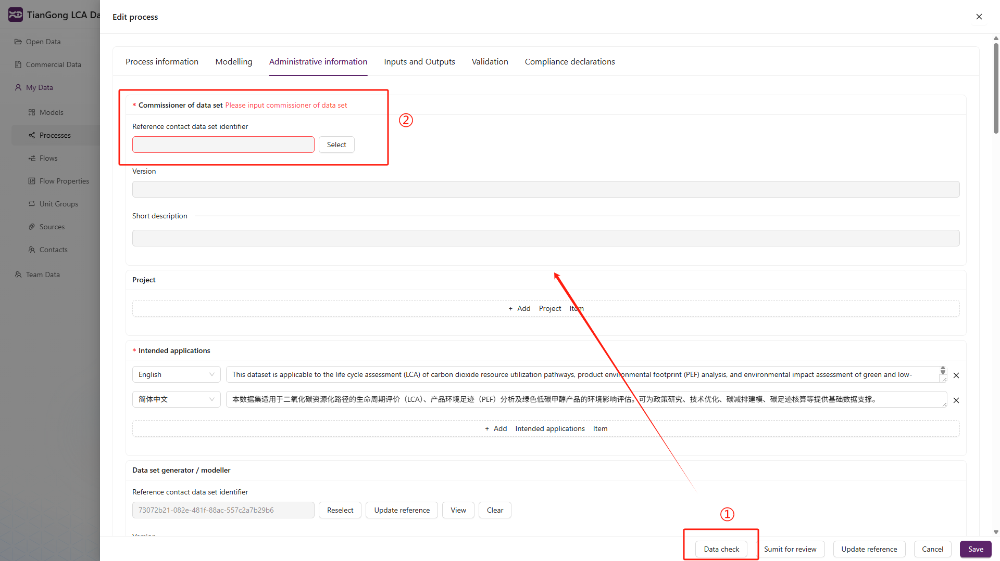

# Data Review

Data review safeguards dataset quality by checking completeness, traceability, and modelling assumptions. This guide outlines the **roles**, **workflow**, **supporting tools**, and **common blockers** involved.

## Roles & responsibilities

| Role | Key actions | Main screens |
| --- | --- | --- |
| **Author** | Prepare data, run self-checks, submit for review, fix feedback | “My Data” editor, message centre |
| **Reviewer** | Inspect submissions, verify references, approve or request changes | “Review” list, message centre |
| **Team admin** | Assign reviewers, monitor progress | “My Team”, status filters |

## Review workflow

1. **Prepare & self-check**  
   - Click `Data check` in the process/model editor to validate required fields before submission.  
   - Address any highlighted issues immediately.  
   

2. **Submit for review**  
   - Use `Submit for review`; the system re-runs the validation.  
   - If problems remain, a modal lists each blocking item—resolve them and resubmit.  
   

3. **Review execution**  
   - Reviewers receive notifications in the message centre and can use the status filters to locate pending items.  
   - Verify references, source quality, language completeness, and modelling assumptions.

4. **Feedback & resolution**  
   - Approved datasets move forward to publication.  
   - Returned datasets include reviewer notes; authors edit the content and submit again.

## Status filters

Use the dropdown in the “Review” list to track progress:

- ✅ **All**: Every record, regardless of state.  
- 🕒 **Unreviewed**: Not yet submitted or assigned.  
- 🔄 **In review**: Awaiting reviewer action.  
- ✔️ **Reviewed**: Completed (approved or returned with comments).

## Common blockers

- **Missing references**: Ensure flows, previous versions, and sources are correctly linked.  
- **Incomplete language fields**: Provide both Chinese and English entries where required.  
- **Insufficient source detail**: Include author, title, publication, year, and DOI/URL; upload attachments if needed.  
- **Custom units/properties misuse**: Confirm custom definitions align with LCIA requirements; prefer standard assets.

If an issue persists, coordinate with the assigned reviewer or your team administrator, and consult the FAQ for known constraints.
