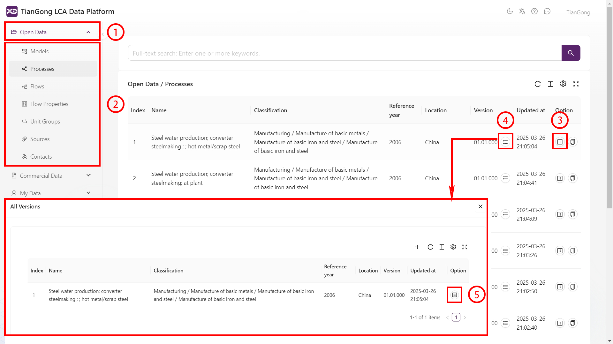
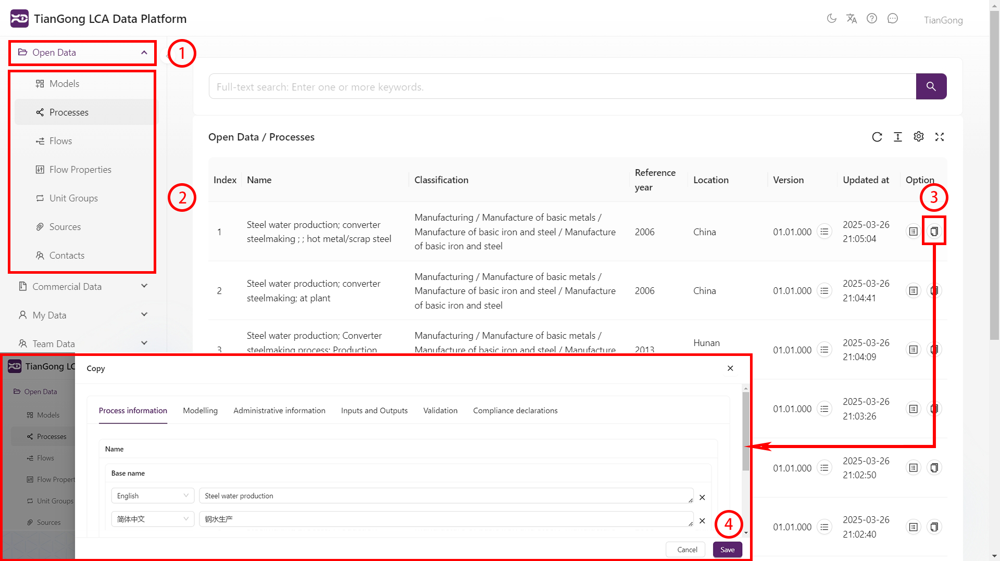

# Data Usage Guide

## Viewing Data

1. Open Data Panel: Locate the left navigation bar and click "Open Data" or "Commercial Data" to activate the data management interface.
2. Navigate Process Directory: Select target entries in the hierarchical list to jump to the corresponding data space.
3. View Data Details: Click the "View" button on the right side of the data list to see comprehensive information including:
   - Geographic coordinates
   - Timestamp ranges
   - System boundaries
   - Input/output inventories
   - Industry and product classifications
   - [Reference: CIFA Guidelines Chapter 6 Appendix](https://www.carbonfootprint.network/docs/cifa-guidelines/lca-database-guideline/chapter-6-appendix#product-classification)
4. View Version History: Click "All Versions" in the dataset list to access the version history page.
5. View Historical Data: Click "View" next to specific versions to see detailed historical data.

## Citing Data

1. Open Selection Panel: Click the "Select" button next to the content you wish to cite to open the information panel.
2. Switch Categories: Use the top navigation bar to select different data categories.
3. Select Data: Check the boxes for target information (selected rows will highlight in purple).
4. Save Changes: Click "Save" at the bottom of the edit page to return to the previous panel.

> Important: **Commercial data cannot be cited**

## Copying Data

1. Open Data Panel: Locate the left navigation bar and click "Open Data" or "Commercial Data".
2. Navigate Process Directory: Select target entries in the hierarchical list.
3. Open Copy Interface: Click "Copy Data" to open the data copying page.
4. Save Changes: Click "Save" to confirm the copy operation.
5. Access Copied Data: Navigate to "My Data" in the left sidebar, select the target entry to view your copied data (which can be modified - see [My Data Guide](./create-my-data.md)).

