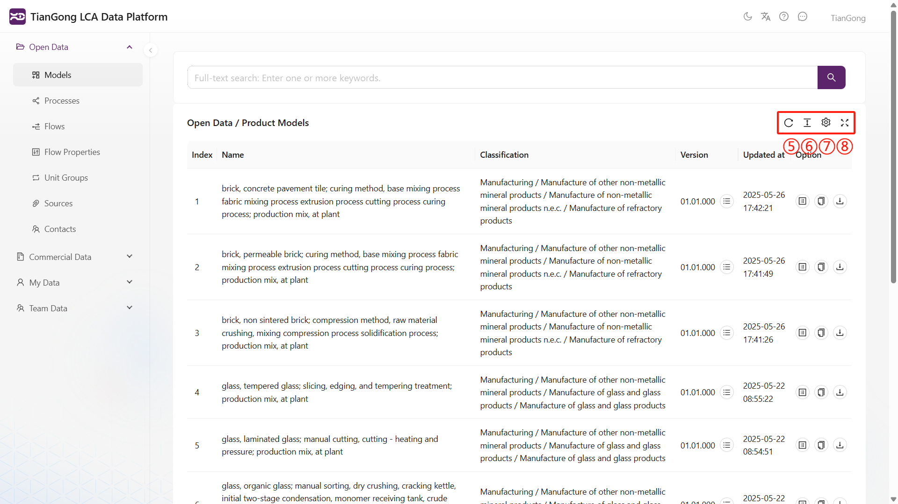
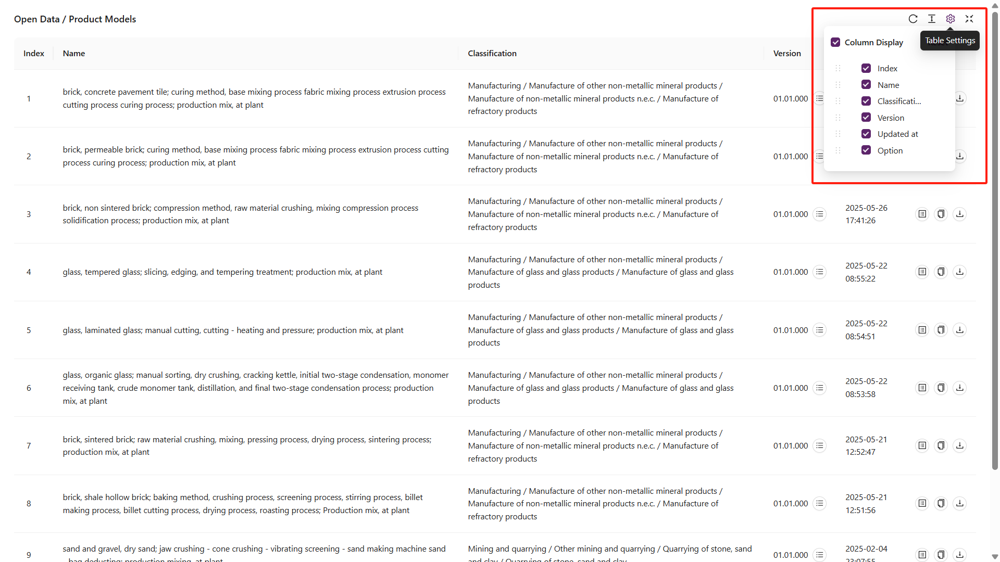
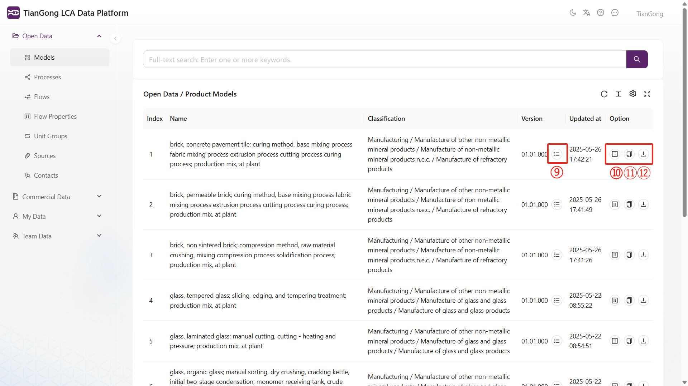
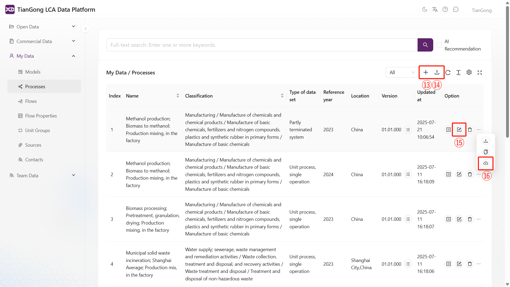
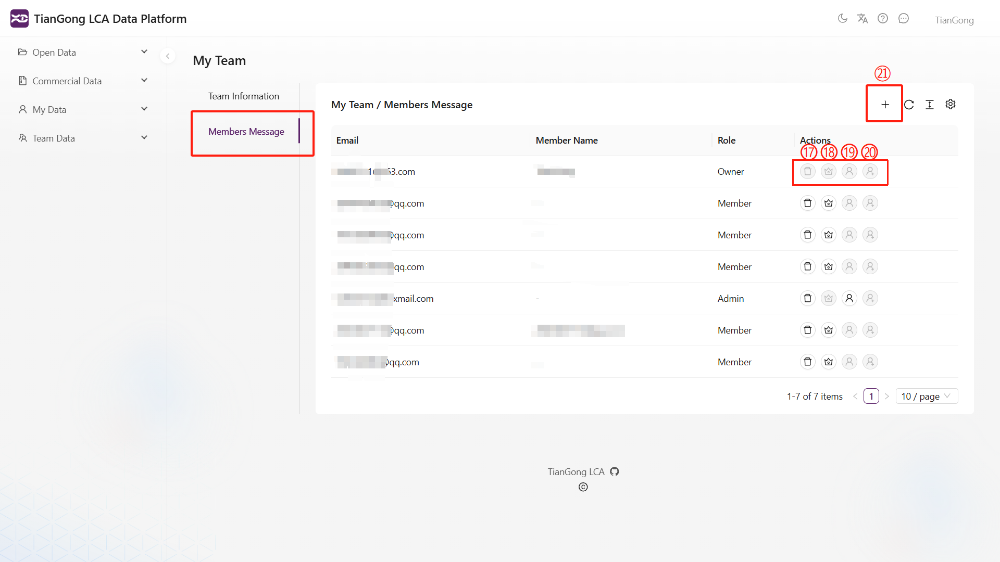

# Key Functions Overview

This guide groups frequently used interface controls by scenario so you can quickly locate the right action while navigating TianGong LCA. Numbers in the screenshots correspond to the labels in each section.

---

## Page Navigation

### Top toolbar

- **Light / Dark mode**: Switch themes to fit your working environment.  
- **Language switcher**: Toggle the UI language.  
- **Documentation link**: Open the TianGong documentation site for detailed guidance.  
- **Message center**: Review notifications and system alerts—coordinate follow-up with the [Team Guide](/en/user-guide/team-function).

### Data table controls

- **Refresh**: Fetch the latest records.  
- **Display density**: Choose Comfortable / Medium / Compact row spacing.  
- **Column settings**: Show or hide columns (ID, Category, Version, Updated At, Actions, etc.); Reset returns to defaults.  
- **Fullscreen**: Hide the sidebar and search bar to maximise the table view.

You can combine column settings with fullscreen to focus on specific attributes:

---

## Data Operations

### Row-level actions

- **View versions**: Inspect the revision history of a dataset.  
- **View details**: Open a read-only view of the full data structure.  
- **Copy**: Duplicate the dataset into “My Data” for editing.  
- **Export JSON**: Download a TIDAS-compatible `.json` file for backup or integration.  
  - ⚠️ Confirm the receiving system understands the TIDAS schema before importing.

### “My Data” exclusive actions

The “My Data” module adds:

- **Add new item**: Create a new process, model, flow, etc. Follow the workflow in [Create My Data](/en/user-guide/create-my-data).  
- **Import**: Upload JSON files that match the TIDAS structure; fields are mapped automatically.  
- **Edit**: Modify the selected record.  
- **Contribute to team**: Share the item with your team workspace for collaborative use.

Importing expects well-formed JSON with no structural errors:

---

## Collaboration & Notifications

### Message centre

The top-right message icon surfaces pending invitations, review decisions, and other alerts. Check it regularly—especially at the start of a work session—to avoid missing required actions.

### Team management actions

Within “My Team”, authorised users can:

- **Invite member / Resend invite**: Search by username and send an invitation.  
- **Set as admin / Set as member**: Promote or demote a teammate’s role.  
- **Remove member**: Revoke access for the selected user.

Refer to [Team Functions](/en/user-guide/team-function#permission-matrix-and-common-actions) for detailed role capabilities and collaboration tips.
