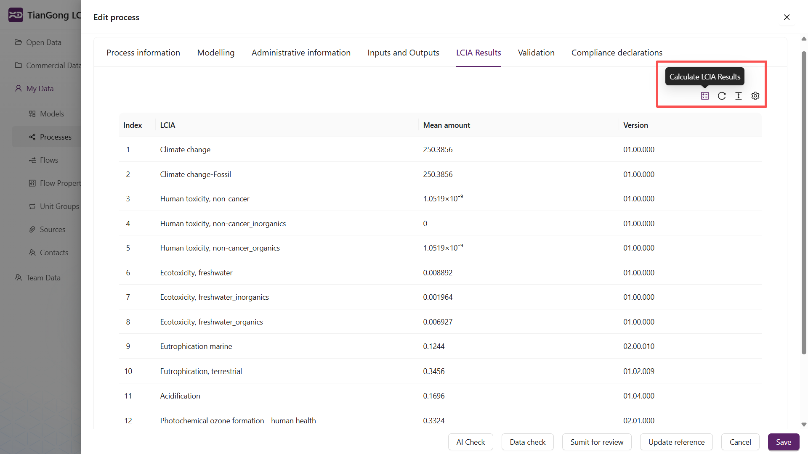

# LCIA Calculation & Results

This page explains how to trigger life cycle impact assessment (LCIA) calculations, interpret the outputs, and resolve common issues.

## Prerequisites

- Use the platform’s standard flow properties and unit groups whenever possible; custom definitions can break LCIA mappings. See [Create My Data](/en/user-guide/create-my-data) for guidance.  
- Ensure the process or model has complete input/output flows and a defined reference flow.  
- Confirm that characterisation factors exist for the chosen impact categories.

## Run the calculation

- **Process level**: Open a process in “My Data → Processes”, click the LCIA button in the editor, and wait for the results panel to populate.  
- **Model level**: Open a model in “My Data → Models”, run LCIA from the results panel, and review outcomes for the entire system.  
  - Running LCIA at the model level captures the combined effects of linked processes, including co-products and waste streams.

## Reading the results

- Results are grouped by impact category (e.g. GWP, ozone depletion, acidification).  
- Values are reported against the reference flow or functional unit specified in the dataset.  
- You can switch categories, compare scenarios, or export data for further analysis.

Process-level calculations only include elementary flows within that process. To analyse combined impacts, build a model with the relevant processes and run LCIA there.

## Troubleshooting

- **Missing or partial results**: Verify that flows use compatible unit groups and flow properties, and that the impact method contains factors for your elementary flows.  
- **Unexpected magnitudes**: Check unit conversions and ensure you are not mixing custom units with platform defaults.  
- **Calculation failures**: Re-run `Data check`, review error prompts, and confirm the dataset references are valid.

If problems persist, revisit the configuration in “My Data”, and consult [Create My Data](/en/user-guide/create-my-data) and [Data Platform Overview](/en/user-guide/data) for foundational setup steps.
