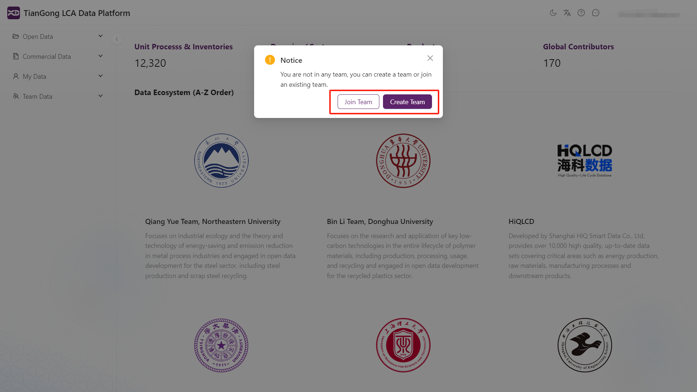
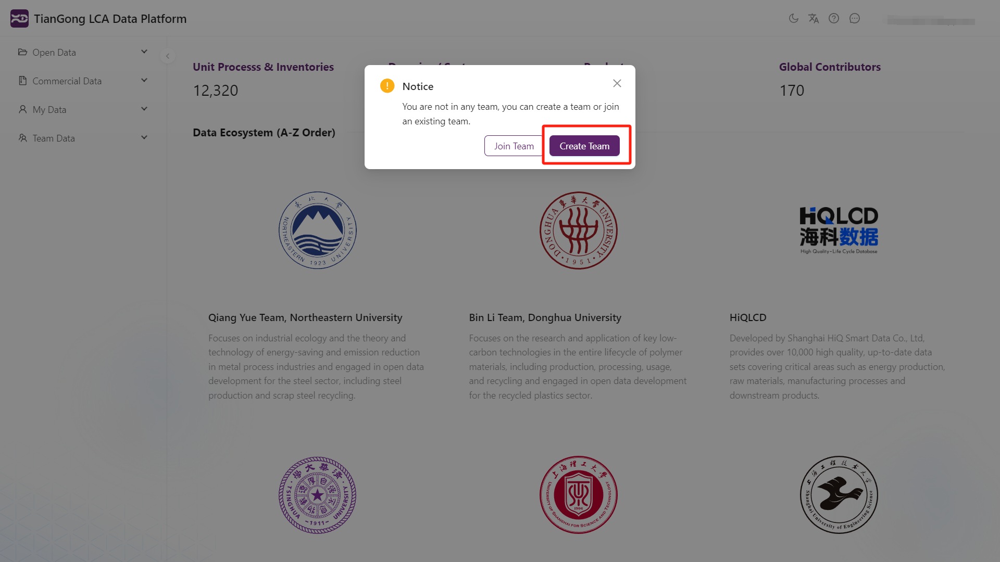
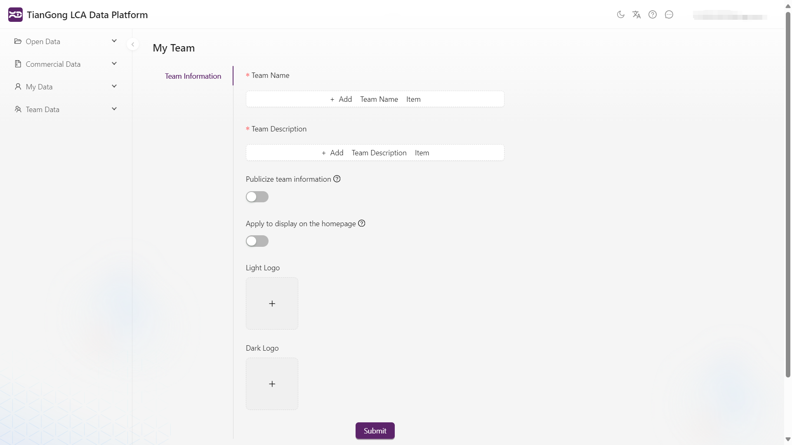
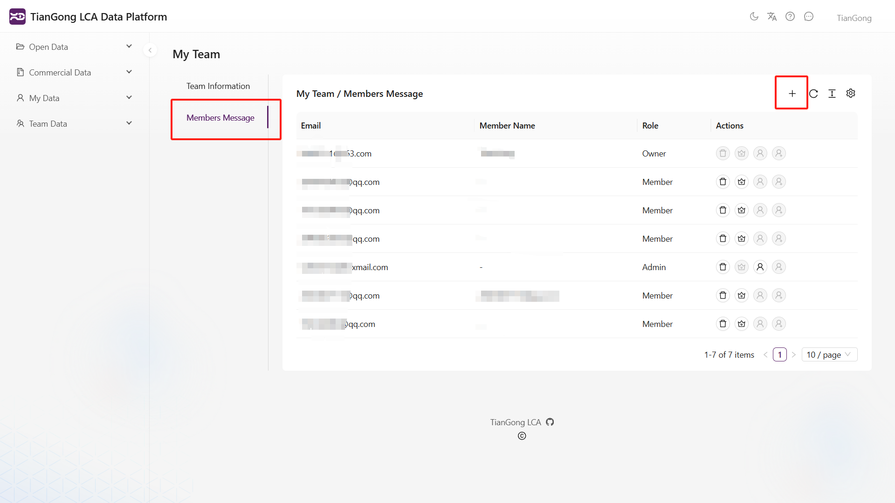
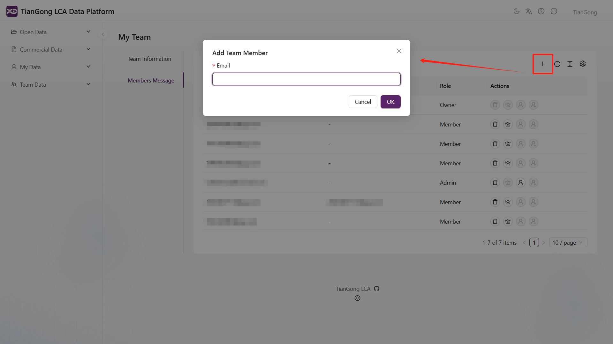
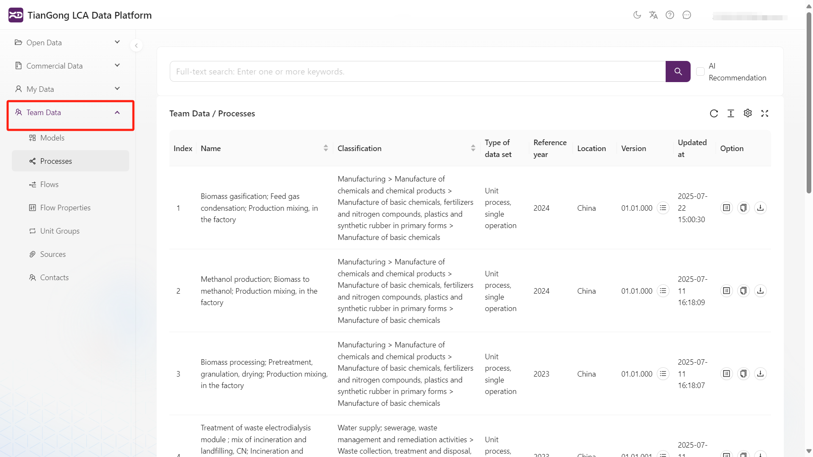

# Team Functionality Guide

This section explains the platform's team collaboration features for managing and sharing lifecycle assessment data.

## Overview

The platform supports team creation and membership for collaborative data management. Users can:

- **Create Teams**: Become team owners with full administrative privileges to manage members and settings.
- **Join Teams**: Requires invitation from team owners or administrators.

Users accessing **My Team** without existing membership can choose to create or join a team.

---

## Creating a Team

Click "Create Team", enter basic information (team name, description), and confirm to establish a new team.

---

## Joining a Team

Standard users can search for teams via "Join Team" and contact owners using provided contact information.

⚠️ Currently only supports **invitation-only membership** - users cannot join teams without owner/admin approval.

---

## Team Invitation Process

1. **Owner/Admin Invitations**:
   Team owners and administrators can invite new members via username search.

   
   

2. **Accepting Invitations**:
   Invited members receive notifications (red dot indicator) and must accept invitations to join.

   

3. **Successful Joining**:
   Members gain access to team data and can contribute to collaborative work.

---

## Team Management Features

The member interface displays:

- **Usernames and emails**
- **Member roles**:
  - `Owner` (creator with full privileges)
  - `Administrator` (assigned management rights)
  - `Member` (standard viewing rights)

Owners can perform these management actions:

- Invite new members
- Assign administrator status
- Revoke administrator privileges
- Resend invitations
- Remove members

Administrators can:

- Invite new members
- Remove existing members

For detailed button functions, see: [Team Button Reference]

---

## Frequently Asked Questions

- **Why don't some flows show units when contributed by team members?**  
Public system flows display units automatically. Member-created flows require synchronization of both process AND flow data to properly display units and properties.
