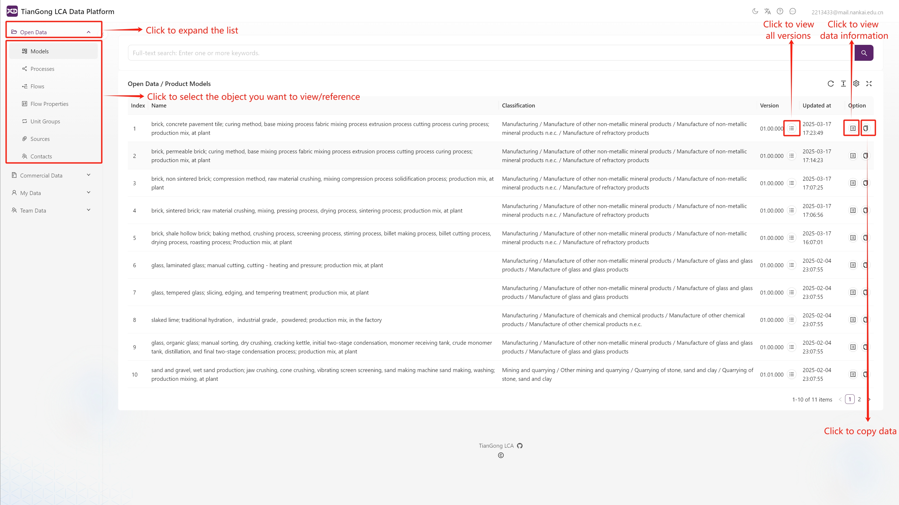
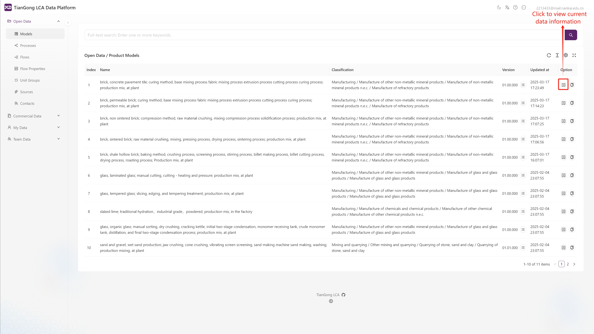
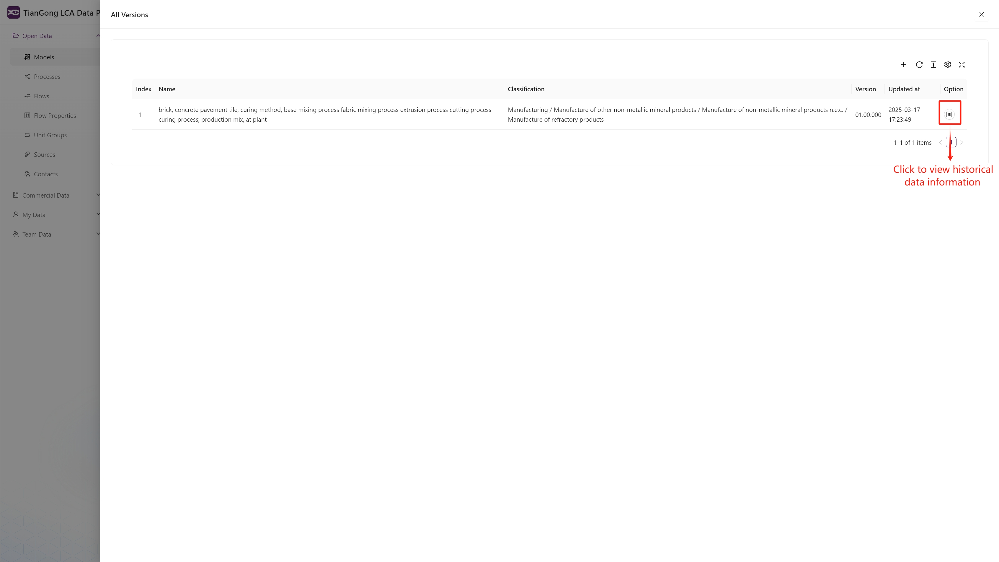
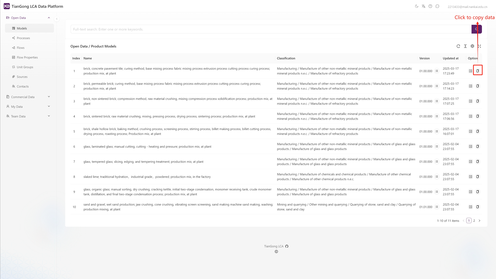
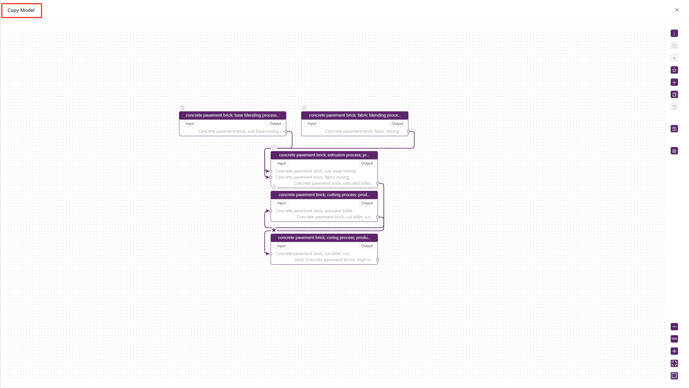
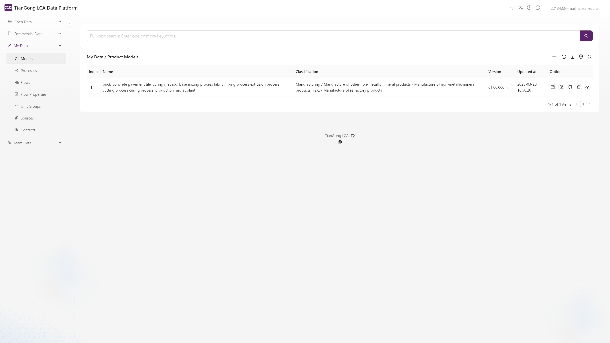
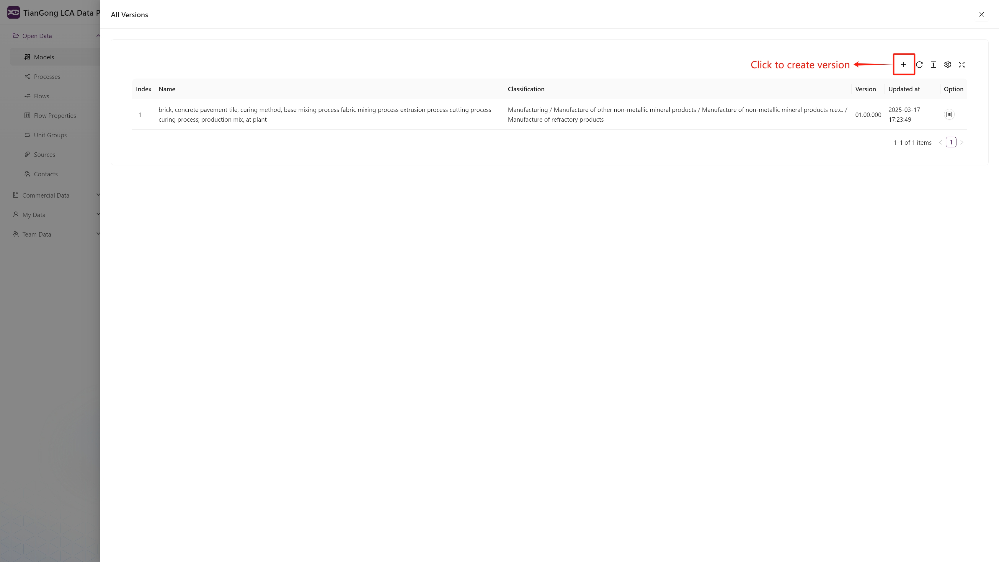
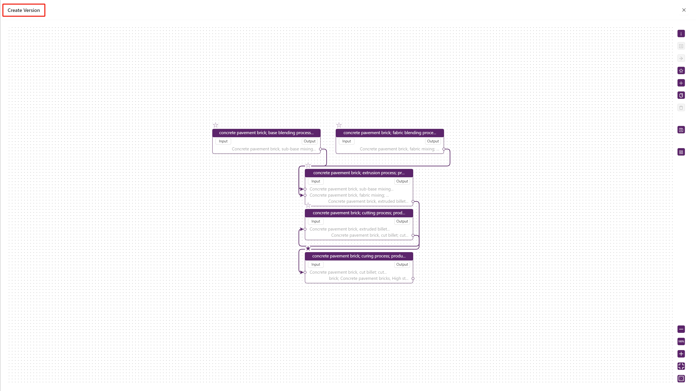
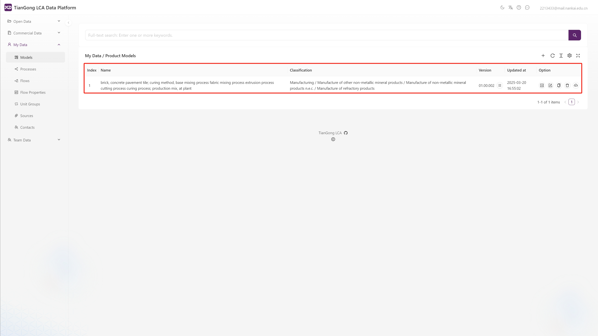

# Open Data and Commercial Data

## Data Comparison

| Data Type | Components | User Permissions | Content |
|-----------|------------|-----------------|---------|
| Open Data | Processes, Flows, Flow Properties, Unit Groups, Sources, Contacts, Models | View/Reference | Standardized life cycle assessment datasets reviewed by the platform |
| Commercial Data | Processes, Flows, Flow Properties, Unit Groups, Sources, Contacts | View | Metadata information (descriptive information) of commercial life cycle assessment datasets |

>Note:  
Both types of data **do not support direct modification**. If you need to adjust data information, you must first save the target data to the ["My Data"](./create-my-data.md) module, then make modifications, and then reference it in the ["My Data"](./create-my-data.md) module.

## Data Operations

All operations use Open Data as examples.

### Page Description

**Dataset Page**

On the main page, click "Open Data" to expand the type list, select the type you want to view or reference, and click to jump to the corresponding page. Users can view complete data information and reference data on this page.

**All Versions Page**

Click the "All Versions" button in the dataset list to jump to the "All Versions" page. Users can view historical version information or create new versions on this page.

### Viewing Data

**Viewing Current Data**  

Click the "View" button on the right side of the list to view the full-dimensional information of the data. This includes [geographic coordinates](link to relevant website), timestamp range, system boundaries, input and output inventory, etc., covering [agriculture, forestry, animal husbandry, fishery, energy and minerals, equipment manufacturing, transportation, construction and real estate, finance and commerce, information technology, biomedicine, culture, education, tourism, and other industries](link to relevant website).

**Viewing Historical Data**

On the "All Versions" page, you can view all historical versions of the data. Click the "View" button on the right side of the page list to view detailed information about historical data.

### Copying Data

**Method 1**  

1. Click "Copy Data" to open the "Copy Information" page, then click "Save" on the popup page.
2. Find the corresponding data copy in the data platform - "My Data" and modify it there (see [My Data](./create-my-data.md) for specific operation guidelines).

**Method 2**

1. Click the "Add New Version" button on the "All Versions" page to enter the "Create Version" page, then click "Save".  
2. Find the corresponding data copy in the data platform - "My Data" and modify it there (see [My Data](./create-my-data.md) for specific operation guidelines).

>Note:  
You must update the version number before saving. The system will verify the uniqueness of the version number, and duplicate version numbers will be rejected.

>**The operation process of the Commercial Data module is exactly the same as that of the Open Data module. Please refer directly to the "Data Operations" section for relevant operation guidelines.**
